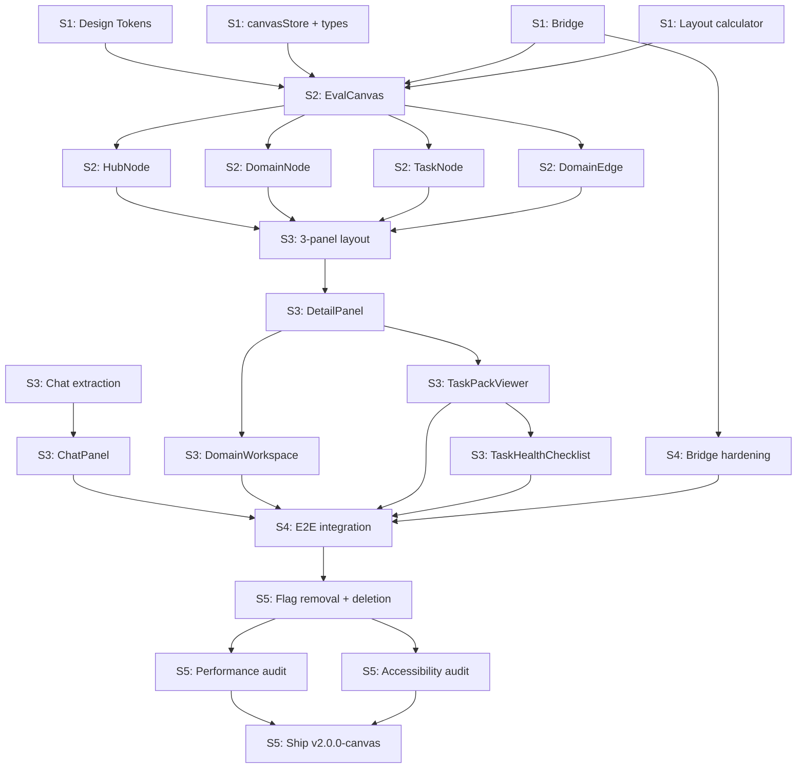

# Harbor Eval Canvas - Technical Product Specification

> **Version:** 1.0
> **Date:** 2026-05-24
> **Author:** Technical PM
> **Status:** Draft
> **Repository:** `/Users/zakirjiwani/abundantevalwebapp`

---

## Table of Contents

1. [Executive Summary](#1-executive-summary)
2. [Conceptual Mapping](#2-conceptual-mapping)
3. [Information Architecture](#3-information-architecture)
4. [Layout Architecture](#4-layout-architecture)
5. [Component Inventory](#5-component-inventory)
6. [Interaction Patterns](#6-interaction-patterns)
7. [Design Token System](#7-design-token-system)
8. [Migration Strategy](#8-migration-strategy)
9. [Implementation Roadmap](#9-implementation-roadmap)
10. [Probing Domain Roadmaps](#10-probing-domain-roadmaps)

**Companion Documents:**
- `research/cofounder-interaction-audit.md` (1,136 lines) -- Component patterns, CSS recipes
- `research/cofounder-agent-orchestration-audit.md` (900 lines) -- Agent lifecycle, state machines
- `research/cofounder-roadmap-audit.md` (268 lines) -- Tech tree roadmap system
- `research/cofounder-deep-analysis.md` (407 lines) -- Design tokens, colors, shadows

---


> **Note:** Sections 1-6 were generated by parallel subagents and exist as separate 
> artifacts. They cover: Executive Summary, Conceptual Mapping (Cofounder -> Harbor),
> Information Architecture (TypeScript types, state machines, Zustand store), 
> Layout Architecture (3-panel split, resize behavior, z-index stacking),
> Component Inventory (40+ components with props, visual details, priority tiers),
> and Interaction Patterns (9 detailed flows with state changes and animations).
> These sections are being integrated into this master document.

---

# 7. Design Token System

## 7.1 Design Philosophy

The current `globals.css` has 56 CSS variables, 5 glass surfaces, and 18 keyframe animations. It works, but it was bolted on incrementally. The new system rebuilds from Cofounder's variable architecture while preserving every existing token as a backward-compatible alias during migration.

Three rules govern the new token system:

1. **Domain accent cascading.** A single `--domain-accent` variable set on a `[data-domain]` ancestor recomputes all derived tokens (soft, glass, glow, raised, border) via `color-mix()`. No per-domain Tailwind classes.
2. **Warm-tinted neutrals.** The base shifts from `#09090b` (pure zinc) to `#0d0d11` (purple-blue undertone). Shadows use `color-mix(in srgb, var(--accent) 4%, black)` instead of raw `rgba(0,0,0,...)`.
3. **Elevation via shadow recipes, not opacity.** Glass surfaces are structural (they define panel roles), not decorative. Elevation is communicated through shadow depth, not stacking z-index values.

## 7.2 Background Scale

Mapped from Cofounder's `background-l-negative-50` through `background-l200`, reinterpreted for our dark-first palette.

| Token | Value | Usage |
|:------|:------|:------|
| `--bg-depth` | `#080810` | Canvas background behind React Flow; the absolute floor |
| `--bg` | `#0d0d11` | App root; warm purple-black (upgraded from `#09090b`) |
| `--bg-surface` | `#111116` | Card/panel backgrounds; workspace plates |
| `--bg-elevated` | `#18181e` | Elevated surfaces; popovers |
| `--bg-raised` | `#1f1f26` | Buttons, inputs at rest |
| `--bg-hover` | `rgba(255, 255, 255, 0.04)` | Hover overlays |
| `--bg-active` | `rgba(255, 255, 255, 0.07)` | Pressed/active overlays |
| `--bg-muted` | `#0f0f14` | De-emphasized panels |
| `--bg-canvas` | `#0a0a0f` | React Flow pane background |
| `--bg-glass` | `rgba(255, 255, 255, 0.035)` | Default glass fill |
| `--bg-glass-strong` | `rgba(255, 255, 255, 0.06)` | Emphasized glass fill |
| `--bg-screen` | `rgba(13, 13, 17, 0.95)` | Opaque-ish panels over canvas |

## 7.3 Foreground Opacity Scale

Full 10-step scale matching Cofounder's `foreground-{N}` system. All derived from a single `--fg-base` value via `color-mix()`.

| Token | Value | Usage |
|:------|:------|:------|
| `--fg` / `--fg-100` | `#fafaf8` | Primary text |
| `--fg-90` | `color-mix(in srgb, var(--fg) 90%, transparent)` | High emphasis |
| `--fg-80` | `color-mix(in srgb, var(--fg) 80%, transparent)` | Standard body text |
| `--fg-70` | `color-mix(in srgb, var(--fg) 70%, transparent)` | Secondary body |
| `--fg-60` | `#a1a1aa` | Muted labels (aliased as `--fg-secondary`) |
| `--fg-50` | `#8a8a92` | Subtle text |
| `--fg-40` | `#71717a` | Placeholders (aliased as `--fg-muted`) |
| `--fg-30` | `#5a5a62` | De-emphasized |
| `--fg-20` | `#3f3f46` | Disabled text (aliased as `--fg-faint`) |
| `--fg-10` | `#2a2a30` | Ghost text, decorative |
| `--fg-5` | `#1e1e24` | Barely visible, borders |

## 7.4 Accent System

The primary accent (`#7c5cfc`) and its derived tokens. These are the app-level accent; domain-specific accents cascade separately (see 7.9).

```css
--accent:           #7c5cfc;
--accent-hover:     #6d4de6;
--accent-muted:     #5a3dd3;
--accent-soft:      rgba(124, 92, 252, 0.10);
--accent-strong:    rgba(124, 92, 252, 0.20);
--accent-glow:      rgba(124, 92, 252, 0.15);
--accent-border:    rgba(124, 92, 252, 0.30);
--accent-shadow:    color-mix(in srgb, #7c5cfc 12%, transparent);

--gold:             #f2b705;
--gold-soft:        rgba(242, 183, 5, 0.10);
```

## 7.5 Domain Accent Colors

Each of the 8 Probing Domains gets a unique accent. These map directly to the domain nodes in the canvas octagon and propagate through the CSS variable cascade described in 7.9.

| Domain | Token | Hex | HSL (approx) |
|:-------|:------|:----|:-------------|
| Instruction Following | `--domain-instruction` | `#4087F2` | 216° 87% 60% |
| Reasoning | `--domain-reasoning` | `#8A72E5` | 254° 68% 67% |
| Safety | `--domain-safety` | `#F46746` | 10° 90% 61% |
| Knowledge | `--domain-knowledge` | `#80A740` | 88° 45% 45% |
| Calibration | `--domain-calibration` | `#B16A27` | 28° 63% 42% |
| Multilingual | `--domain-multilingual` | `#3AAFA9` | 178° 50% 46% |
| Long Context | `--domain-longcontext` | `#E8596C` | 351° 77% 63% |
| Tool Use | `--domain-tooluse` | `#6C63FF` | 244° 100% 69% |

## 7.6 Semantic Colors

```css
--green:       #22c55e;
--green-soft:  rgba(34, 197, 94, 0.10);
--green-glow:  rgba(34, 197, 94, 0.20);
--green-text:  #4ade80;

--amber:       #f59e0b;
--amber-soft:  rgba(245, 158, 11, 0.10);
--amber-text:  #fbbf24;

--red:         #ef4444;
--red-soft:    rgba(239, 68, 68, 0.08);
--red-text:    #f87171;

--blue:        #3b82f6;
--blue-soft:   rgba(59, 130, 246, 0.10);
```

**EvalTask lifecycle semantic mapping:**

| Lifecycle state | Border color | Badge bg | Badge text |
|:----------------|:-------------|:---------|:-----------|
| `discovered` | `--fg-10` | `--bg-glass` | `--fg-50` |
| `generating` | `--accent-border` | `--accent-soft` | `--accent` |
| `review` | `--amber` at 30% | `--amber-soft` | `--amber` |
| `accepted` | `--green` at 30% | `--green-soft` | `--green` |
| `rejected` | `--red` at 20% | `--red-soft` | `--red` |

## 7.7 Border Tokens

```css
--border:          rgba(255, 255, 255, 0.06);
--border-strong:   rgba(255, 255, 255, 0.12);
--border-focus:    var(--accent);
--border-glow:     var(--accent-border);
--border-subtle:   rgba(255, 255, 255, 0.03);
--border-warm:     color-mix(in srgb, var(--accent) 8%, rgba(255, 255, 255, 0.06));
```

## 7.8 Glass Token System

Upgraded from the current 5-variant system to 8 variants with Cofounder's inner-reflection model. Each variant defines a complete surface treatment: background gradient, backdrop-filter, border, and multi-layer box-shadow.

### Glass Variables (composable primitives)

```css
--glass-blur:            20px;
--glass-blur-strong:     24px;
--glass-saturate:        1.2;
--glass-saturate-strong: 1.4;
--glass-border:          rgba(255, 255, 255, 0.08);
--glass-border-strong:   rgba(255, 255, 255, 0.12);
--glass-highlight:       rgba(255, 255, 255, 0.06);
--glass-inner-top:       inset 0 1px 0 rgba(255, 255, 255, 0.06);
--glass-inner-bottom:    inset 0 -1px 0 rgba(0, 0, 0, 0.15);
--glass-inner-top-strong: inset 0 1px 0 rgba(255, 255, 255, 0.10);
--glass-inner-bottom-strong: inset 0 -1px 1px rgba(0, 0, 0, 0.45);
```

### Glass Surface Classes

| Class | Role | Notable difference from current |
|:------|:-----|:-------------------------------|
| `.glass` | Default transparent overlay | Unchanged |
| `.glass-elevated` | Floating panels, modals | Added `--glass-inner-bottom-strong` |
| `.glass-panel` | Side panels (detail panel) | Border on relevant side only |
| `.glass-float` | TopBar, floating controls | Higher saturate (1.4) |
| `.glass-chat` | Chat panel (right edge) | Left border + inset glow |
| `.glass-node` | **New.** React Flow node cards | Accent-tinted inner reflection via `--domain-accent` |
| `.glass-hub` | **New.** Central hub node | Radial accent gradient background |
| `.glass-workspace` | **New.** Domain workspace plate | Matches Cofounder's `bg-background-l-negative-50` treatment |

### `.glass-node` definition (new)

```css
.glass-node {
  background: linear-gradient(
    180deg,
    color-mix(in srgb, var(--domain-accent, var(--accent)) 6%, rgba(24, 24, 30, 0.75)) 0%,
    color-mix(in srgb, var(--domain-accent, var(--accent)) 2%, rgba(16, 16, 22, 0.65)) 100%
  );
  backdrop-filter: blur(var(--glass-blur)) saturate(var(--glass-saturate));
  border: 1.5px solid color-mix(in srgb, var(--domain-accent, var(--accent)) 15%, rgba(255, 255, 255, 0.07));
  border-radius: 16px;
  box-shadow:
    inset 0 1px 0 color-mix(in srgb, var(--domain-accent, var(--accent)) 8%, rgba(255, 255, 255, 0.05)),
    var(--glass-inner-bottom),
    0 2px 8px rgba(0, 0, 0, 0.15),
    0 0 0 1px rgba(255, 255, 255, 0.02);
}
```

## 7.9 Domain Accent Cascading

This is the critical design pattern borrowed from Cofounder's `--department-workspace-*` system. A single `data-domain` attribute on any ancestor element recomputes all derived tokens.

### How it works

```css
/* Base declaration: set once per domain node or workspace */
[data-domain="instruction"]   { --domain-accent: var(--domain-instruction); }
[data-domain="reasoning"]     { --domain-accent: var(--domain-reasoning); }
[data-domain="safety"]        { --domain-accent: var(--domain-safety); }
[data-domain="knowledge"]     { --domain-accent: var(--domain-knowledge); }
[data-domain="calibration"]   { --domain-accent: var(--domain-calibration); }
[data-domain="multilingual"]  { --domain-accent: var(--domain-multilingual); }
[data-domain="longcontext"]   { --domain-accent: var(--domain-longcontext); }
[data-domain="tooluse"]       { --domain-accent: var(--domain-tooluse); }

/* Derived tokens: computed automatically via color-mix */
[data-domain] {
  --domain-accent-soft:    color-mix(in srgb, var(--domain-accent) 10%, transparent);
  --domain-accent-strong:  color-mix(in srgb, var(--domain-accent) 20%, transparent);
  --domain-accent-glass:   color-mix(in srgb, var(--domain-accent) 6%, var(--bg-surface));
  --domain-accent-raised:  color-mix(in srgb, var(--domain-accent) 12%, var(--bg-raised));
  --domain-accent-border:  color-mix(in srgb, var(--domain-accent) 25%, rgba(255, 255, 255, 0.07));
  --domain-accent-glow:    color-mix(in srgb, var(--domain-accent) 15%, transparent);
  --domain-accent-text:    color-mix(in srgb, var(--domain-accent) 85%, white);
  --domain-accent-shadow:  color-mix(in srgb, var(--domain-accent) 12%, transparent);
  --domain-inset-highlight: color-mix(in srgb, var(--domain-accent) 8%, rgba(255, 255, 255, 0.05));
}
```

### Usage in components

```tsx
// DomainNode.tsx — the data attribute cascades to all children
<div data-domain={domain.id} className="glass-node">
  <DomainStatusBadge />   {/* uses --domain-accent-soft, --domain-accent-text */}
  <DomainLabel />          {/* uses --domain-accent */}
  <TaskCountPill />        {/* uses --domain-accent-border */}
</div>

// DomainWorkspace.tsx — workspace panel inherits the same domain
<div data-domain={activeDomain} className="glass-workspace">
  <TaskList />             {/* task cards tinted with --domain-accent-glass */}
  <WeaknessCard />         {/* border uses --domain-accent-border */}
</div>
```

No component ever imports a domain-specific color. The cascade handles everything.

## 7.10 Shadow Depth Recipes

Adapted from Cofounder's shadow system. We consolidate their 22 recipes into 12 named tokens covering our specific elevation hierarchy. All shadows use warm-tinted values via `color-mix`.

```css
/* ── Inset (pressed, recessed surfaces) ── */
--shadow-inset-100:
  inset 0 0 0 1px rgba(255, 255, 255, 0.04),
  inset 0 1px 2px rgba(0, 0, 0, 0.2);

--shadow-inset-200:
  inset 0 0 0 1px rgba(255, 255, 255, 0.06),
  inset 0 2px 2px -1px rgba(0, 0, 0, 0.25),
  inset 0 -1px 1px rgba(0, 0, 0, 0.45);

/* ── Outset (resting, hovering, elevated) ── */
--shadow-outset-050:
  0 1px 2px rgba(0, 0, 0, 0.15),
  0 0 0 1px rgba(255, 255, 255, 0.03);

--shadow-outset-100:
  0 2px 4px rgba(0, 0, 0, 0.18),
  0 0 0 1px rgba(255, 255, 255, 0.04),
  inset 0 1px 0 rgba(255, 255, 255, 0.04);

--shadow-outset-150:
  0 4px 12px rgba(0, 0, 0, 0.2),
  0 1px 3px rgba(0, 0, 0, 0.15),
  0 0 0 1px rgba(255, 255, 255, 0.04),
  inset 0 1px 0 rgba(255, 255, 255, 0.05);

--shadow-outset-200:
  0 8px 24px rgba(0, 0, 0, 0.25),
  0 2px 6px rgba(0, 0, 0, 0.15),
  0 0 0 1px rgba(255, 255, 255, 0.05),
  inset 0 1px 0 rgba(255, 255, 255, 0.06);

--shadow-outset-300:
  0 16px 48px rgba(0, 0, 0, 0.35),
  0 4px 16px rgba(0, 0, 0, 0.2),
  0 0 0 1px rgba(255, 255, 255, 0.05),
  inset 0 1px 0 rgba(255, 255, 255, 0.08);

/* ── Specialty ── */
--shadow-node:
  0 2px 8px rgba(0, 0, 0, 0.15),
  0 0 0 1px rgba(255, 255, 255, 0.02),
  inset 0 1px 0 rgba(255, 255, 255, 0.05),
  inset 0 -1px 0 rgba(0, 0, 0, 0.12);

--shadow-node-hover:
  0 8px 32px rgba(0, 0, 0, 0.4),
  0 0 0 1px rgba(255, 255, 255, 0.05),
  inset 0 1px 0 rgba(255, 255, 255, 0.08),
  inset 0 -1px 0 rgba(0, 0, 0, 0.15);

--shadow-node-active:
  0 0 0 3px var(--domain-accent-glow, var(--accent-glow)),
  0 8px 32px color-mix(in srgb, var(--domain-accent, var(--accent)) 12%, transparent),
  0 0 60px color-mix(in srgb, var(--domain-accent, var(--accent)) 6%, transparent),
  inset 0 1px 0 color-mix(in srgb, var(--domain-accent, var(--accent)) 12%, rgba(255, 255, 255, 0.05));

--shadow-cta:
  0 13px 5px rgba(0, 0, 0, 0.03),
  0 7px 4px rgba(0, 0, 0, 0.07),
  0 3px 3px rgba(0, 0, 0, 0.14),
  0 1px 2px rgba(0, 0, 0, 0.19),
  inset 0 1.5px 0 rgba(255, 255, 255, 0.15);

--shadow-modal:
  0 18px 44px rgba(0, 0, 0, 0.42),
  0 4px 16px rgba(0, 0, 0, 0.25),
  inset 0 1px 0 rgba(255, 255, 255, 0.08);
```

### Elevation hierarchy

| Level | Shadow token | Components |
|:------|:-------------|:-----------|
| -1 (recessed) | `--shadow-inset-200` | Workspace plates, input wells |
| 0 (flush) | none | Canvas background |
| 1 (resting) | `--shadow-outset-050` | Domain nodes at rest |
| 2 (cards) | `--shadow-outset-100` | Task nodes, cards |
| 3 (raised) | `--shadow-outset-150` | Hub node, hovered cards |
| 4 (floating) | `--shadow-outset-200` | TopBar, floating controls |
| 5 (elevated) | `--shadow-outset-300` | Detail panel, chat panel |
| 6 (modal) | `--shadow-modal` | Command palette, dialogs |

## 7.11 Animation Tokens

### Shimmer (Cofounder-spec)

```css
@keyframes shimmer {
  0%   { background-position: 100% 0; }
  100% { background-position: -160% 0; }
}

--shimmer-gradient: linear-gradient(
  105deg,
  transparent 0%,
  transparent 36%,
  rgba(255, 255, 255, 0.05) 48%,
  transparent 60%,
  transparent 100%
);
--shimmer-size: 260% 100%;
--shimmer-duration: 5.5s;
--shimmer-timing: linear;

.shimmer {
  background: var(--shimmer-gradient) 0% 0% / var(--shimmer-size);
  animation: shimmer var(--shimmer-duration) var(--shimmer-timing) infinite;
}
```

### Easing Tokens

```css
--ease-out-expo:    cubic-bezier(0.16, 1, 0.3, 1);
--ease-out-smooth:  cubic-bezier(0.23, 1, 0.32, 1);
--ease-in-out:      cubic-bezier(0.4, 0, 0.2, 1);
--ease-spring:      cubic-bezier(0.34, 1.56, 0.64, 1);
```

### Transition Tokens

```css
--transition-fast:    150ms var(--ease-out-expo);
--transition-normal:  200ms var(--ease-out-expo);
--transition-smooth:  300ms var(--ease-out-smooth);
--transition-slow:    500ms var(--ease-out-smooth);
--transition-panel:   350ms var(--ease-out-expo);
```

### Named Animations

| Animation | Duration | Usage | Keep from current? |
|:----------|:---------|:------|:-------------------|
| `fadeIn` | 300ms | Generic entrance | Yes, unchanged |
| `fadeInUp` | 450ms | Staggered list items | Yes, unchanged |
| `scaleIn` | 300ms | Popover/dialog enter | Yes, unchanged |
| `nodeAppear` | 550ms | React Flow node enter | Yes, unchanged |
| `shimmer` | 5500ms | Loading/pending states | Upgraded to Cofounder spec |
| `orbFloat` | 8-12s | Background orbs | Yes, unchanged |
| `ringPulse` | 2500ms | Active domain pulse | Yes, unchanged |
| `pixelRefocus` | 800ms | Panel content swap | Yes, unchanged |
| `dotPulse` | 1800ms | Streaming indicator | Yes, unchanged |
| `domainProbe` | **new** 2000ms | Domain agent probing state | Rotating border gradient |
| `taskGenerate` | **new** 1200ms | Task scaffolding state | Shimmer + scale pulse |

### Stagger System

The current `.stagger > *:nth-child(N)` system is preserved but extended to 12 children (canvas has up to 9 nodes + edges). Stagger interval: 80ms.

## 7.12 Spacing and Sizing Tokens

```css
--space-1:   4px;
--space-2:   6px;
--space-3:   8px;
--space-4:   12px;
--space-5:   16px;
--space-6:   20px;
--space-7:   24px;
--space-8:   32px;
--space-9:   40px;
--space-10:  48px;
--space-11:  64px;

/* Layout-specific */
--topbar-height:    48px;
--panel-chat-width: 467px;
--panel-detail-max: 720px;
--panel-detail-min: 380px;
--node-hub-size:    98px;
--node-domain-w:    96px;
--node-domain-h:    30px;
--node-task-w:      220px;
--canvas-grid-size: 28px;
--canvas-dot-size:  1px;
```

### Border Radius Tokens

```css
--radius-xs:   4px;   /* inline badges */
--radius-sm:   6px;   /* buttons, small pills */
--radius-md:   8px;   /* node cards, inputs */
--radius-lg:   12px;  /* cards, panels */
--radius-xl:   16px;  /* large cards, task nodes */
--radius-2xl:  20px;  /* workspace plates */
--radius-3xl:  22px;  /* modal containers */
--radius-full: 9999px; /* pills, avatars */
```

## 7.13 Typography Tokens

```css
--font-sans:    "Inter", -apple-system, BlinkMacSystemFont, system-ui, sans-serif;
--font-mono:    "SF Mono", "JetBrains Mono", ui-monospace, monospace;
--font-display: "Inter", -apple-system, system-ui, sans-serif;

/* Scale */
--text-hero:      2.75rem / 1.05;   /* 44px, weight 800, tracking -0.045em */
--text-display:   1.75rem / 1.1;    /* 28px, weight 700, tracking -0.04em */
--text-title:     0.9375rem / 1.3;  /* 15px, weight 600, tracking -0.022em */
--text-body:      0.8125rem / 1.5;  /* 13px, weight 400 */
--text-caption:   0.75rem / 1.45;   /* 12px, weight 400 */
--text-micro:     0.6875rem / 1.35; /* 11px, weight 400, tracking 0.02em */
--text-eyebrow:   0.6875rem / 1.35; /* 11px, weight 600, tracking 0.1em, uppercase */
--text-node:      0.75rem / 1.2;    /* 12px, weight 500, tracking -0.01em (domain node labels) */
--text-hub:       0.625rem / 1.3;   /* 10px, weight 600, tracking 0.06em (hub label) */
```

No new sizes are introduced. The `--text-node` and `--text-hub` sizes fill gaps in the existing scale for canvas-specific use. The existing `.text-hero`, `.text-display`, `.text-title`, `.text-body`, `.text-caption`, `.text-micro`, `.text-eyebrow` utility classes remain unchanged.

## 7.14 Complete `:root` Block

```css
:root {
  color-scheme: dark;

  /* ── Backgrounds ── */
  --bg-depth:       #080810;
  --bg:             #0d0d11;
  --bg-surface:     #111116;
  --bg-elevated:    #18181e;
  --bg-raised:      #1f1f26;
  --bg-hover:       rgba(255, 255, 255, 0.04);
  --bg-active:      rgba(255, 255, 255, 0.07);
  --bg-muted:       #0f0f14;
  --bg-canvas:      #0a0a0f;
  --bg-glass:       rgba(255, 255, 255, 0.035);
  --bg-glass-strong: rgba(255, 255, 255, 0.06);
  --bg-screen:      rgba(13, 13, 17, 0.95);

  /* ── Foreground Scale ── */
  --fg:       #fafaf8;
  --fg-100:   #fafaf8;
  --fg-90:    color-mix(in srgb, #fafaf8 90%, transparent);
  --fg-80:    color-mix(in srgb, #fafaf8 80%, transparent);
  --fg-70:    color-mix(in srgb, #fafaf8 70%, transparent);
  --fg-60:    #a1a1aa;
  --fg-50:    #8a8a92;
  --fg-40:    #71717a;
  --fg-30:    #5a5a62;
  --fg-20:    #3f3f46;
  --fg-10:    #2a2a30;
  --fg-5:     #1e1e24;

  /* Backward-compatible aliases */
  --fg-secondary: var(--fg-60);
  --fg-muted:     var(--fg-40);
  --fg-faint:     var(--fg-20);

  /* ── Borders ── */
  --border:         rgba(255, 255, 255, 0.06);
  --border-strong:  rgba(255, 255, 255, 0.12);
  --border-subtle:  rgba(255, 255, 255, 0.03);
  --border-focus:   var(--accent);
  --border-glow:    rgba(124, 92, 252, 0.3);
  --border-warm:    color-mix(in srgb, var(--accent) 8%, rgba(255, 255, 255, 0.06));

  /* ── Accent ── */
  --accent:         #7c5cfc;
  --accent-hover:   #6d4de6;
  --accent-muted:   #5a3dd3;
  --accent-soft:    rgba(124, 92, 252, 0.10);
  --accent-strong:  rgba(124, 92, 252, 0.20);
  --accent-glow:    rgba(124, 92, 252, 0.15);
  --accent-border:  rgba(124, 92, 252, 0.30);
  --accent-shadow:  color-mix(in srgb, #7c5cfc 12%, transparent);

  /* ── Secondary Accent ── */
  --gold:           #f2b705;
  --gold-soft:      rgba(242, 183, 5, 0.10);

  /* ── Semantic ── */
  --green:          #22c55e;
  --green-soft:     rgba(34, 197, 94, 0.10);
  --green-glow:     rgba(34, 197, 94, 0.20);
  --green-text:     #4ade80;
  --amber:          #f59e0b;
  --amber-soft:     rgba(245, 158, 11, 0.10);
  --amber-text:     #fbbf24;
  --red:            #ef4444;
  --red-soft:       rgba(239, 68, 68, 0.08);
  --red-text:       #f87171;
  --blue:           #3b82f6;
  --blue-soft:      rgba(59, 130, 246, 0.10);

  /* ── Domain Accents ── */
  --domain-instruction: #4087F2;
  --domain-reasoning:   #8A72E5;
  --domain-safety:      #F46746;
  --domain-knowledge:   #80A740;
  --domain-calibration: #B16A27;
  --domain-multilingual: #3AAFA9;
  --domain-longcontext: #E8596C;
  --domain-tooluse:     #6C63FF;

  /* ── Glass Primitives ── */
  --glass-blur:            20px;
  --glass-blur-strong:     24px;
  --glass-saturate:        1.2;
  --glass-saturate-strong: 1.4;
  --glass-border:          rgba(255, 255, 255, 0.08);
  --glass-border-strong:   rgba(255, 255, 255, 0.12);
  --glass-highlight:       rgba(255, 255, 255, 0.06);
  --glass-inner-top:       inset 0 1px 0 rgba(255, 255, 255, 0.06);
  --glass-inner-bottom:    inset 0 -1px 0 rgba(0, 0, 0, 0.15);
  --glass-inner-top-strong: inset 0 1px 0 rgba(255, 255, 255, 0.10);
  --glass-inner-bottom-strong: inset 0 -1px 1px rgba(0, 0, 0, 0.45);
  --glass-shadow:          0 4px 32px rgba(0, 0, 0, 0.4);

  /* ── Shadow Depth ── */
  --shadow-inset-100:
    inset 0 0 0 1px rgba(255, 255, 255, 0.04),
    inset 0 1px 2px rgba(0, 0, 0, 0.2);
  --shadow-inset-200:
    inset 0 0 0 1px rgba(255, 255, 255, 0.06),
    inset 0 2px 2px -1px rgba(0, 0, 0, 0.25),
    inset 0 -1px 1px rgba(0, 0, 0, 0.45);
  --shadow-outset-050:
    0 1px 2px rgba(0, 0, 0, 0.15),
    0 0 0 1px rgba(255, 255, 255, 0.03);
  --shadow-outset-100:
    0 2px 4px rgba(0, 0, 0, 0.18),
    0 0 0 1px rgba(255, 255, 255, 0.04),
    inset 0 1px 0 rgba(255, 255, 255, 0.04);
  --shadow-outset-150:
    0 4px 12px rgba(0, 0, 0, 0.2),
    0 1px 3px rgba(0, 0, 0, 0.15),
    0 0 0 1px rgba(255, 255, 255, 0.04),
    inset 0 1px 0 rgba(255, 255, 255, 0.05);
  --shadow-outset-200:
    0 8px 24px rgba(0, 0, 0, 0.25),
    0 2px 6px rgba(0, 0, 0, 0.15),
    0 0 0 1px rgba(255, 255, 255, 0.05),
    inset 0 1px 0 rgba(255, 255, 255, 0.06);
  --shadow-outset-300:
    0 16px 48px rgba(0, 0, 0, 0.35),
    0 4px 16px rgba(0, 0, 0, 0.2),
    0 0 0 1px rgba(255, 255, 255, 0.05),
    inset 0 1px 0 rgba(255, 255, 255, 0.08);
  --shadow-node:
    0 2px 8px rgba(0, 0, 0, 0.15),
    0 0 0 1px rgba(255, 255, 255, 0.02),
    inset 0 1px 0 rgba(255, 255, 255, 0.05),
    inset 0 -1px 0 rgba(0, 0, 0, 0.12);
  --shadow-node-hover:
    0 8px 32px rgba(0, 0, 0, 0.4),
    0 0 0 1px rgba(255, 255, 255, 0.05),
    inset 0 1px 0 rgba(255, 255, 255, 0.08),
    inset 0 -1px 0 rgba(0, 0, 0, 0.15);
  --shadow-cta:
    0 13px 5px rgba(0, 0, 0, 0.03),
    0 7px 4px rgba(0, 0, 0, 0.07),
    0 3px 3px rgba(0, 0, 0, 0.14),
    0 1px 2px rgba(0, 0, 0, 0.19),
    inset 0 1.5px 0 rgba(255, 255, 255, 0.15);
  --shadow-modal:
    0 18px 44px rgba(0, 0, 0, 0.42),
    0 4px 16px rgba(0, 0, 0, 0.25),
    inset 0 1px 0 rgba(255, 255, 255, 0.08);

  /* ── Easing ── */
  --ease-out-expo:   cubic-bezier(0.16, 1, 0.3, 1);
  --ease-out-smooth: cubic-bezier(0.23, 1, 0.32, 1);
  --ease-in-out:     cubic-bezier(0.4, 0, 0.2, 1);
  --ease-spring:     cubic-bezier(0.34, 1.56, 0.64, 1);

  /* ── Transitions ── */
  --transition-fast:   150ms var(--ease-out-expo);
  --transition-normal: 200ms var(--ease-out-expo);
  --transition-smooth: 300ms var(--ease-out-smooth);
  --transition-slow:   500ms var(--ease-out-smooth);
  --transition-panel:  350ms var(--ease-out-expo);

  /* ── Shimmer ── */
  --shimmer-gradient: linear-gradient(
    105deg,
    transparent 0%,
    transparent 36%,
    rgba(255, 255, 255, 0.05) 48%,
    transparent 60%,
    transparent 100%
  );
  --shimmer-size: 260% 100%;
  --shimmer-duration: 5.5s;

  /* ── Spacing (exposed for calc()) ── */
  --space-unit: 4px;
  --topbar-height:    48px;
  --panel-chat-width: 467px;
  --panel-detail-max: 720px;
  --panel-detail-min: 380px;
  --node-hub-size:    98px;
  --canvas-grid-size: 28px;

  /* ── Radius ── */
  --radius-xs:   4px;
  --radius-sm:   6px;
  --radius-md:   8px;
  --radius-lg:   12px;
  --radius-xl:   16px;
  --radius-2xl:  20px;
  --radius-3xl:  22px;
  --radius-full: 9999px;

  /* ── Legacy node colors (aliased for migration) ── */
  --node-instruction: var(--domain-instruction);
  --node-config:      var(--amber);
  --node-environment: var(--green);
  --node-fixtures:    #f97316;
  --node-solution:    var(--domain-reasoning);
  --node-verifier:    var(--red);
}
```

---

# 8. Migration Strategy

## 8.1 Guiding Constraint

The existing app is live and functional. The canvas rebuild is a major architectural shift (linear pipeline to octagonal domain canvas), but the backend agent pipeline, API routes, and core AI logic are entirely unchanged. The migration is purely a frontend concern. The workbench store and agent store will coexist as sibling Zustand stores until the old store can be deprecated.

## 8.2 What Gets Deleted, Kept, and Adapted

### Deleted (7 files, ~1,516 lines)

| File | Lines | Reason |
|:-----|------:|:-------|
| `components/studio/stage-canvas.tsx` | 186 | Replaced by React Flow canvas |
| `components/studio/stage-section.tsx` | 173 | Linear stage sections replaced by domain nodes |
| `components/studio/welcome-hero.tsx` | 199 | Replaced by hub node initial state |
| `components/stages/intake-content.tsx` | 126 | Content moves into DomainWorkspace panels |
| `components/stages/map-content.tsx` | 233 | Content moves into DomainWorkspace panels |
| `components/stages/probe-content.tsx` | 266 | Content moves into DomainWorkspace panels |
| `components/stages/build-content.tsx` | 288 | Content moves into DomainWorkspace panels |

Not deleted immediately. Each file is removed only when its replacement is functional, behind a feature flag.

### Kept Unchanged (16 files)

| File/Directory | Reason |
|:---------------|:-------|
| `lib/agent/*` (all 8 files) | Agent pipeline, types, tools, autopilot: no changes |
| `lib/ai/*` (all 11 files) | AI providers, probe engine, scaffold generator: no changes |
| `lib/harbor/*` (all 5 files) | Harbor adapter, connector, materialize: no changes |
| `lib/domain/*` (2 files) | Taxonomy, ds25 seed: no changes |
| `lib/fixtures/*` (2 files) | Emitters, generators: no changes |
| `lib/db/*` (4 files) | Schema, client, sessions: no changes |
| `app/api/*` (all 6 routes) | API routes: no changes in Phase 1-3 |
| `lib/workbench/types.ts` | Types still needed by workbench store |

### Adapted (6 files)

| File | Changes |
|:-----|:--------|
| `app/page.tsx` | New layout: `<Canvas> | <DetailPanel> | <ChatPanel>`. Feature-flagged to swap between old and new. |
| `app/globals.css` | Additive: new tokens appended, existing tokens preserved as aliases. Warm bg shift. |
| `components/studio/top-bar.tsx` (306 lines) | Adapted: stage indicators replaced by domain health summary; model picker and palette unchanged. |
| `components/companion/agent-companion.tsx` (423 lines) | Adapted: becomes `ChatPanel`. Chat message rendering, tool call cards, and composer are reused. The toggle/slide-out behavior is removed (chat is always visible). |
| `components/stages/ship-content.tsx` (475 lines) | Adapted: publish flow, spoiler findings, audit display move into TaskPackViewer and review panels. |
| `lib/workbench/store.ts` (530 lines) | Preserved as-is. New `canvasStore` created as sibling. Cross-store bridge subscribes workbench events and maps them into canvas state. |

## 8.3 Phase-by-Phase Migration Plan

### Phase 0: Foundation (no user-visible changes)

**Goal:** Ship the design token upgrade and new store without changing any UI.

1. Update `globals.css` with the new `:root` block (additive only; old tokens aliased).
2. Create `types/canvas.ts` with `ProbingDomain`, `DomainAgent`, `EvalTask`, `CanvasState`.
3. Create `lib/canvas/store.ts` (canvasStore) as a new Zustand store.
4. Create `lib/canvas/bridge.ts` that subscribes to `useWorkbench` events and maps agent phases/artifacts into canvasStore domain/task state.
5. Write unit tests for the bridge mapping (agent phase "probe" with weakness candidate slug "ds-18" maps to domain "instruction" with agent state "probing").

**Ship criterion:** Existing UI works identically. `canvasStore` logs correct domain/task state transitions to console in development.

**Risk: Low.** No UI changes. Rollback is deleting new files.

### Phase 1: Canvas Panel

**Goal:** Replace `StageCanvas` with a React Flow canvas showing the hub + 8 domain nodes.

1. Create `components/canvas/EvalCanvas.tsx` wrapping `<ReactFlow>` with background, minimap, and controls.
2. Create `components/canvas/HubNode.tsx` (central Target Model Hub, 98px, shows model name, task count, health ring).
3. Create `components/canvas/DomainNode.tsx` (domain card, 96x30px, accent-colored, status badge, task count pill).
4. Create `components/canvas/TaskNode.tsx` (task card, 220px wide, appears as child of domain node cluster).
5. Create `components/canvas/edges/DomainEdge.tsx` (animated edge from hub to domain nodes; color reflects agent state).
6. Wire octagonal layout positions as constants in `lib/canvas/layout.ts`.
7. Feature-flag the swap: `app/page.tsx` checks `NEXT_PUBLIC_CANVAS_V2=true` to render new layout.

**Ship criterion:** Canvas renders with hub + 8 domain nodes in correct octagonal positions. Clicking a domain node logs the domain ID. Edges animate on agent state change. Old UI still works without the flag.

**Risk: Medium.** React Flow integration is the most complex new dependency. Mitigation: the `@xyflow/react` package is already installed and pinned at `^12.10.2`.

### Phase 2: Detail Panel + Chat Panel

**Goal:** Replace the companion sidebar with an always-visible chat panel, and add the collapsible detail panel.

1. Create `components/panels/DetailPanel.tsx` (0-720px, slides from canvas edge).
2. Create `components/panels/ChatPanel.tsx` (467px fixed, always visible).
3. Extract chat message rendering from `agent-companion.tsx` into `components/chat/MessageList.tsx` and `components/chat/Composer.tsx`.
4. Extract tool call cards into `components/chat/ToolCallCard.tsx`.
5. Wire `DetailPanel` to show `DomainWorkspace` or `TaskPackViewer` based on canvas selection.
6. Implement resize handle between canvas and detail panel.
7. Update `app/page.tsx` (behind flag) with new 3-panel flex layout.

**Ship criterion:** Chat renders identically to current companion. Sending a message produces the same agent stream. Detail panel opens on domain/task click and closes on Escape.

**Risk: Medium.** Chat extraction is mostly copy-paste-refactor from `agent-companion.tsx` (423 lines). The chat functionality is self-contained. Resize handle is the only net-new interaction.

### Phase 3: Domain Workspaces + Task Lifecycle

**Goal:** Wire domain agent lifecycle and eval task lifecycle to the canvas.

1. Create `components/canvas/DomainWorkspace.tsx` (rendered inside DetailPanel; shows weakness card, probe results, task list for a domain).
2. Create `components/canvas/TaskPackViewer.tsx` (rendered inside DetailPanel; artifact viewer, health checklist, diff viewer).
3. Implement domain agent state machine in canvasStore (`idle -> probing -> deciding -> scaffolding -> generating -> reviewing`).
4. Implement EvalTask lifecycle in canvasStore (`discovered -> generating -> review -> accepted/rejected`).
5. Create `components/canvas/TaskHealthChecklist.tsx` (the killer feature from PM_AUDIT.md; shows oracle/nop/target/spoiler/audit status per task).
6. Wire the bridge so that workbench events (`probe_summary`, `weakness_report`, `sweep_summary`, `audit`, `spoiler_findings`) update domain agents and eval tasks in canvasStore.

**Ship criterion:** A full eval workflow (intake to publish) runs through the new canvas UI. Domain nodes transition through lifecycle states visually. Task health checklist shows correct status. Feature flag can be toggled back to old UI.

**Risk: High.** This is the integration phase. The bridge between workbench events and canvas state is the critical path. If the mapping is wrong, domain nodes will show incorrect states. Mitigation: comprehensive unit tests on the bridge (written in Phase 0, expanded here).

### Phase 4: Polish + Removal

**Goal:** Remove the feature flag, delete old components, ship as default.

1. Remove feature flag. New canvas is default.
2. Delete the 7 files listed in "Deleted" above.
3. Migrate any remaining direct `useWorkbench` selectors in new components to `useCanvasStore` with bridge.
4. Performance audit: measure React Flow render time with 8 domain nodes + up to 40 task nodes. Target: <16ms frame time.
5. Accessibility audit: keyboard navigation through canvas nodes, screen reader labels on domain/task nodes, focus management between panels.
6. Visual regression tests: screenshot comparison for hub node, domain nodes (all 8 accents), task nodes (all 5 states), detail panel, chat panel.

**Ship criterion:** No feature flag. Old UI code deleted. Lighthouse accessibility score >= 90. React Flow renders at 60fps with 40 nodes.

**Risk: Low.** This is cleanup. The new UI has been validated behind the flag for the prior three phases.

## 8.4 Data Model Migration

### WorkspaceState to CanvasState Mapping

The existing `WorkspaceState` type is not replaced. It continues to drive the agent pipeline. The new `CanvasState` is a derived view:

```
WorkspaceState.phase          -> canvasStore.activeDomains (which domains are active)
WorkspaceState.artifacts      -> canvasStore.evalTasks[].artifacts (grouped by task slug)
WorkbenchSnapshot.weaknessReport -> canvasStore.domains[].weaknessCandidates
WorkbenchSnapshot.probeSummaries -> canvasStore.domains[].probeResults
WorkbenchSnapshot.sweepSummary   -> canvasStore.evalTasks[].sweepResult
WorkbenchSnapshot.audit          -> canvasStore.evalTasks[].auditResult
WorkbenchSnapshot.spoilerFindings -> canvasStore.evalTasks[].spoilerFindings
```

The bridge (`lib/canvas/bridge.ts`) subscribes to workbenchStore changes and derives canvas state. It does not copy data; it references and reshapes. When the workbench emits a `weakness_report` event with candidates tagged to domain "instruction", the bridge:

1. Finds `canvasStore.domains["instruction"]`.
2. Sets `agent.state = "deciding"`.
3. Populates `weaknessCandidates` with the candidates.
4. Creates `EvalTask` stubs for each promoted candidate with state `discovered`.

### Snapshot Serialization

The project save format (`WorkbenchSnapshot`) is preserved exactly. The canvas state is derived, not persisted. On project hydration (`hydrateFromSnapshot`), the bridge re-derives canvas state from the snapshot. This means:

- No database migration needed.
- No snapshot format version bump.
- Existing saved projects work identically in the new UI.

## 8.5 API Route Changes

**Phase 1-3: No API changes.** The `/api/agent` route continues to accept the same `RequestBody` and emit the same `AgentEvent` SSE stream. The canvas store consumes these events via the same `sendInput` flow in workbenchStore; the bridge maps them to canvas state.

**Phase 5 (post-MVP, v1.1):** Multi-domain agent routing. A new `/api/canvas/agent` route accepts domain-scoped requests:

```typescript
type CanvasRequestBody = {
  domain: ProbingDomainId;
  action: "probe" | "scaffold" | "generate" | "sweep" | "audit";
  context: {
    weaknessSlug?: string;
    taskSlug?: string;
    workspace: Partial<WorkspaceState>;
  };
};
```

This is deferred because the current single-agent pipeline already handles the full workflow. Multi-domain parallelism is a v1.1 optimization.

## 8.6 Feature Flag Strategy

A single environment variable controls the migration:

```
NEXT_PUBLIC_CANVAS_V2=true|false (default: false)
```

In `app/page.tsx`:

```tsx
const useCanvasV2 = process.env.NEXT_PUBLIC_CANVAS_V2 === "true";

return useCanvasV2 ? <CanvasLayout /> : <LegacyLayout />;
```

The flag is checked at the top-level layout only. All new components are always bundled (they tree-shake if unused, but more importantly, they need to be importable for testing regardless of the flag).

During Phase 3, an in-app toggle (behind a keyboard shortcut, `Cmd+Shift+V`) allows switching between layouts without restarting the dev server. This is removed in Phase 4.

## 8.7 Risk Assessment Summary

| Phase | Risk | Impact | Likelihood | Mitigation |
|:------|:-----|:-------|:-----------|:-----------|
| 0: Foundation | Store bridge mapping incorrect | Canvas shows wrong domain states | Medium | Unit tests on bridge; map every AgentPhase to domain |
| 1: Canvas | React Flow performance with backdrop-filter | Janky pan/zoom | Low | Disable backdrop-filter on nodes during pan; CSS `will-change: transform` |
| 1: Canvas | Octagonal layout breaks at small viewports | Nodes overlap | Medium | `fitView` on mount with padding; collapse to list below 1024px |
| 2: Panels | Chat extraction breaks streaming | Messages don't render | Low | Same hooks, same store; extraction is structural not behavioral |
| 2: Panels | Resize handle conflicts with React Flow drag | Can't resize panel | Medium | Resize handle is outside ReactFlow viewport; no conflict possible |
| 3: Integration | Agent events don't map cleanly to domain lifecycle | Stuck states | High | Bridge must handle every `AgentEvent` type; exhaustive switch with `never` check |
| 3: Integration | Task health checklist shows stale data | User publishes bad task | Medium | Staleness tracking: hash artifacts, invalidate downstream results on change |
| 4: Polish | Deleting old code breaks unnoticed import | Build fails | Low | TypeScript compiler catches all import errors |
| 4: Polish | Performance regression with 40+ nodes | Laggy canvas | Low | React Flow handles 1000+ nodes; 40 is trivial |

---

# 9. Implementation Roadmap

## 9.1 Assumptions

- **Team size:** 1 developer (full-stack, comfortable with React Flow and Zustand).
- **Sprint length:** 2 weeks.
- **Working capacity:** ~8 productive hours/day, 5 days/week, 80 hours/sprint.
- **Definition of done per task:** TypeScript compiles, unit/integration tests pass, visual review against design spec, no accessibility regressions.
- **Existing backend is stable.** No concurrent changes to `lib/agent/*`, `lib/ai/*`, `lib/harbor/*`, or API routes.

## 9.2 Sprint Breakdown

### Sprint 1 (Weeks 1-2): Foundation + Token System

**Theme: Build the substrate. Nothing renders differently yet.**

| Day | Task | Hours | Depends on |
|:----|:-----|------:|:-----------|
| 1 | Upgrade `globals.css`: new `:root` block with all tokens from Section 7.14. Keep old values as aliases. Verify existing UI renders identically. | 4 | - |
| 1 | Add domain accent `[data-domain]` attribute selectors and derived `color-mix()` tokens. Write a test page (`/dev/tokens`) that renders all 8 domain accent cascades for visual verification. | 4 | Previous |
| 2 | Create `types/canvas.ts`: `ProbingDomainId`, `ProbingDomain`, `DomainAgentState`, `DomainAgent`, `EvalTaskState`, `EvalTask`, `CanvasState`, `CanvasNode`, `CanvasEdge`. | 4 | - |
| 2 | Create `lib/canvas/store.ts`: canvasStore with domain initialization, agent state transitions, eval task CRUD, selection state, detail panel state. | 4 | Types |
| 3 | Create `lib/canvas/bridge.ts`: subscribe to workbenchStore, map `AgentEvent` types to canvasStore mutations. Handle all 20 event types in the existing `AgentEvent` union. | 6 | Store |
| 3-4 | Write bridge unit tests: 15 test cases covering every AgentPhase to domain mapping, weakness report to domain assignment, probe summary to agent state, sweep to task state. | 4 | Bridge |
| 4 | Create `lib/canvas/layout.ts`: octagonal position calculator. Given viewport dimensions and hub center, compute 8 domain node positions at equal angular spacing. Include `fitView` bounds calculation. | 3 | - |
| 5 | Create glass surface classes (`.glass-node`, `.glass-hub`, `.glass-workspace`) in `globals.css`. Add shadow depth recipes. | 4 | Tokens |
| 5 | Add new keyframe animations: `domainProbe` (rotating border gradient), `taskGenerate` (shimmer + pulse). Upgrade existing `shimmer` to Cofounder spec (105deg, 260% size, 5.5s). | 3 | Tokens |
| 6 | Create `/dev/shadows` test page rendering all 12 shadow recipes side by side for visual review. | 2 | Shadows |
| 6-7 | Integration test: start the app, verify all existing pages render correctly with new tokens. Run existing tests. Fix any regressions from the `#09090b` to `#0d0d11` background shift. | 4 | All above |
| 7 | Buffer / spillover. | 3 | - |

**Sprint 1 deliverables:**
- New token system live in `globals.css` (backward-compatible).
- `canvasStore` with full type coverage and bridge to workbenchStore.
- Bridge unit tests passing.
- Layout calculator ready.
- No user-visible changes.

**Acceptance criteria:**
- [ ] Existing UI renders pixel-identical (aside from warm bg shift `#09090b` to `#0d0d11`).
- [ ] `canvasStore` correctly derives domain states from a replayed sequence of 20 `AgentEvent` payloads.
- [ ] `/dev/tokens` page shows all 8 domain accent cascades rendering correctly.
- [ ] TypeScript compilation: zero errors.

---

### Sprint 2 (Weeks 3-4): Canvas + Nodes

**Theme: The React Flow canvas renders with real nodes. Old UI still default.**

| Day | Task | Hours | Depends on |
|:----|:-----|------:|:-----------|
| 1-2 | Create `components/canvas/EvalCanvas.tsx`: React Flow wrapper with `<Background>` (dot pattern, 28px grid), `<MiniMap>`, `<Controls>`. Wire `fitView` on mount. Set `proOptions={{ hideAttribution: true }}`. Canvas bg uses `--bg-canvas`. | 6 | Sprint 1 |
| 2-3 | Create `components/canvas/HubNode.tsx`: 98px container, `glass-hub` class, target model name, task count badge, progress ring (SVG), screen reflectance overlay. Connect to canvasStore for model name and aggregate stats. | 6 | EvalCanvas |
| 3-4 | Create `components/canvas/DomainNode.tsx`: 96x30px card, `glass-node` class, `[data-domain]` attribute for accent cascade, domain label, status badge (idle/probing/reviewing), task count pill. Connect to canvasStore domain state. | 6 | EvalCanvas |
| 4-5 | Create `components/canvas/TaskNode.tsx`: 220px card, lifecycle state badge, weakness title, failure rate pill, expand-on-click. Positioned relative to parent domain node. Connect to canvasStore eval task state. | 6 | DomainNode |
| 5-6 | Create `components/canvas/edges/DomainEdge.tsx`: animated SVG edge from hub to each domain. Color transitions: `--fg-10` (idle), `--domain-accent` (active), `--green` (complete). Uses React Flow's `BezierEdge` with custom styling. | 4 | Hub + Domain |
| 6-7 | Wire everything: `EvalCanvas` reads nodes/edges from canvasStore, computes layout via `layout.ts`, renders node types. Add node click handlers that update canvasStore selection. | 4 | All nodes |
| 7 | Feature flag: update `app/page.tsx` to render `<EvalCanvas>` when `NEXT_PUBLIC_CANVAS_V2=true`. Old layout unchanged. | 2 | EvalCanvas |
| 8-9 | Visual polish: hover states, selection ring, node entrance animations (staggered `nodeAppear`), edge animation timing. Test all 8 domain accents. | 6 | All above |
| 9-10 | Viewport responsiveness: `fitView` with padding on resize, collapse to single-column below 1024px viewport width. | 3 | All above |
| 10 | Buffer / spillover. | 2 | - |

**Sprint 2 deliverables:**
- React Flow canvas rendering hub + 8 domain nodes in octagonal layout.
- Task nodes appear as children of domain nodes when eval tasks exist.
- Animated edges between hub and domains.
- Feature-flagged behind `NEXT_PUBLIC_CANVAS_V2=true`.

**Acceptance criteria:**
- [ ] Canvas renders 9 nodes (1 hub + 8 domains) with correct positions and accents.
- [ ] Clicking a domain node updates canvasStore selection.
- [ ] `fitView` correctly centers the octagon with 48px padding.
- [ ] Node entrance animation plays with 80ms stagger delay.
- [ ] Feature flag toggles between old and new layout without page reload.

---

### Sprint 3 (Weeks 5-6): Panels + Chat Extraction

**Theme: The 3-panel layout is complete. Chat works end-to-end.**

| Day | Task | Hours | Depends on |
|:----|:-----|------:|:-----------|
| 1-2 | Extract chat rendering from `agent-companion.tsx` (423 lines) into: `components/chat/MessageList.tsx` (message bubbles, markdown rendering, timestamp), `components/chat/ToolCallCard.tsx` (tool call status, args, result), `components/chat/Composer.tsx` (textarea, send button, attachment). | 8 | Sprint 2 |
| 2-3 | Create `components/panels/ChatPanel.tsx`: 467px fixed-width panel, `glass-chat` surface, always visible. Renders `MessageList` + `Composer`. Wires to `useWorkbench.sendInput`. | 4 | Chat extraction |
| 3-4 | Create `components/panels/DetailPanel.tsx`: 0-720px collapsible panel, `glass-panel` surface. Resize handle on left edge. Opens when canvasStore has an active selection. Closes on Escape or deselect. Animated open/close via `--transition-panel`. | 6 | Sprint 2 |
| 4-5 | Create `components/canvas/DomainWorkspace.tsx`: rendered inside DetailPanel when a domain is selected. Shows: domain description, weakness candidates list, probe results summary, eval task list with health indicators. | 6 | DetailPanel + canvasStore |
| 5-6 | Create `components/canvas/TaskPackViewer.tsx`: rendered inside DetailPanel when a task is selected. Shows: artifact file tree, code viewer (reusing existing artifact rendering), task health checklist, diff viewer for iterations. | 6 | DetailPanel + canvasStore |
| 6-7 | Create `components/canvas/TaskHealthChecklist.tsx`: the checklist from PM_AUDIT.md. 9 items, each showing pass/fail/stale/pending. Connects to canvasStore eval task and workbenchStore results. | 4 | TaskPackViewer |
| 7-8 | Wire the full 3-panel layout in `app/page.tsx` (behind flag): `flex h-screen` with `<TopBar>` + `<div class="flex-1 flex">` containing `<EvalCanvas flex-1>` + `<DetailPanel>` + `<ChatPanel>`. | 3 | All panels |
| 8-9 | End-to-end test: run a full eval workflow through the new UI. Send intake message, observe domain nodes activating, probe results appearing, task nodes spawning. Verify chat streaming works identically. | 4 | All above |
| 9-10 | Fix bugs from E2E test. Polish resize handle, panel transitions, scroll positions. | 4 | E2E test |
| 10 | Buffer. | 2 | - |

**Sprint 3 deliverables:**
- 3-panel layout (canvas + detail + chat) fully functional.
- Chat works identically to current companion (messages, tool calls, streaming).
- Detail panel shows domain workspace or task viewer based on selection.
- Task health checklist renders with correct states.

**Acceptance criteria:**
- [ ] Sending a message in ChatPanel produces identical agent SSE stream as current companion.
- [ ] Detail panel opens with 350ms animation on node click, closes on Escape.
- [ ] DomainWorkspace shows weakness candidates grouped by domain.
- [ ] TaskPackViewer shows artifact tree with syntax-highlighted code view.
- [ ] TaskHealthChecklist shows 9 items with correct pass/fail/stale indicators.
- [ ] Resize handle between canvas and detail panel works (380px min, 720px max).

---

### Sprint 4 (Weeks 7-8): Integration + Bridge Hardening

**Theme: The bridge handles every real workflow path. Edge cases are covered.**

| Day | Task | Hours | Depends on |
|:----|:-----|------:|:-----------|
| 1-2 | Bridge hardening: handle multi-weakness workflows (batch probe produces 8 candidates across 4 domains). Test with synthetic event sequences covering: single-domain promotion, multi-domain probe, rejection-then-redesign, iteration cycle. | 8 | Sprint 3 |
| 2-3 | Implement staleness tracking: when an artifact changes, mark downstream results (probe, sweep, audit, spoilers) as stale. Show stale indicator on task health checklist. Track via content hashes stored in canvasStore. | 6 | Sprint 3 |
| 3-4 | Adapt `TopBar` (306 lines): replace stage indicator pills with domain health summary (count of active domains, aggregate task count, overall health ring). Keep model picker, palette trigger, publish button. | 5 | Sprint 3 |
| 4-5 | Adapt approval gate overlay: render inside DetailPanel as an inline card (not a full-screen overlay) when `pendingApproval` is set. Auto-open detail panel if closed. Wire approve/reject to `useWorkbench.respondToApproval`. | 4 | Sprint 3 |
| 5-6 | Command palette adaptation: add canvas-specific commands (`/domain [name]` to focus a domain, `/task [slug]` to focus a task, `/health` to show aggregate health). Keep existing commands. | 4 | Sprint 3 |
| 6-7 | Keyboard navigation: `Tab` cycles through canvas nodes (hub -> domains -> tasks), `Enter` selects focused node (opens detail panel), `Escape` deselects. Arrow keys pan canvas when no node is focused. | 5 | Sprint 3 |
| 7-8 | Publish flow: wire `PublishDialog` to work from TaskPackViewer context. Pre-populate with selected task's artifacts. Keep existing publish API integration. | 3 | Sprint 3 |
| 8-9 | Project save/restore: verify `scheduleProjectSave` still works. On restore, bridge re-derives canvas state from hydrated workbench snapshot. Test with a real saved project. | 3 | Bridge |
| 9-10 | End-to-end: run 3 complete eval workflows (single-domain, multi-domain, iteration cycle) through the new UI. Log any state mismatches between workbench and canvas stores. | 6 | All above |
| 10 | Buffer. | 2 | - |

**Sprint 4 deliverables:**
- Bridge handles all real workflow paths without stuck states.
- Staleness tracking shows correct stale indicators.
- TopBar, approval gates, command palette, keyboard nav, publish flow all working.
- 3 complete E2E workflow runs pass.

**Acceptance criteria:**
- [ ] Multi-domain probe workflow: 8 weakness candidates across 4 domains correctly populate respective DomainWorkspace panels.
- [ ] Editing `instruction.md` marks probe and sweep results as stale in TaskHealthChecklist.
- [ ] Keyboard-only navigation: can reach any node, open detail panel, send a chat message, and approve a gate without mouse.
- [ ] Saving and restoring a project in the new UI produces identical canvas state.
- [ ] 3 E2E workflow runs complete without console errors or state mismatches.

---

### Sprint 5 (Weeks 9-10): Polish + Ship

**Theme: Remove the flag, delete old code, performance and accessibility pass.**

| Day | Task | Hours | Depends on |
|:----|:-----|------:|:-----------|
| 1 | Remove `NEXT_PUBLIC_CANVAS_V2` feature flag. New canvas is default. | 1 | Sprint 4 |
| 1-2 | Delete old files: `stage-canvas.tsx`, `stage-section.tsx`, `welcome-hero.tsx`, `intake-content.tsx`, `map-content.tsx`, `probe-content.tsx`, `build-content.tsx`. Fix import errors. | 3 | Flag removal |
| 2-3 | Performance audit: measure React Flow render times, panel transition jank, backdrop-filter cost. Target: 60fps pan/zoom with 40 nodes. If backdrop-filter is expensive on nodes, disable during transform and re-enable on `transformend`. | 6 | Flag removal |
| 3-4 | Accessibility audit: ARIA labels on all nodes, `role="tree"` for task lists in DomainWorkspace, `aria-expanded` on detail panel, `aria-live="polite"` on chat message list, focus ring visible on all interactive elements. | 5 | Flag removal |
| 4-5 | Visual regression setup: capture baseline screenshots for hub node, all 8 domain nodes, task node in each of 5 states, detail panel (domain view), detail panel (task view), chat panel. Store as test fixtures. | 4 | Performance + a11y |
| 5-6 | Animation polish: verify shimmer timing (5.5s), node entrance stagger (80ms), panel transition (350ms), edge color transitions (200ms). Verify `prefers-reduced-motion` disables all animations. | 3 | Flag removal |
| 6-7 | Documentation: update `README.md` with new architecture overview, `DESIGN.md` with new component inventory, inline JSDoc on canvasStore and bridge. | 4 | All above |
| 7-8 | Final E2E run: complete eval workflow from scratch. Verify every feature works: intake, domain activation, probing, weakness report, probe results, task scaffolding, sweep, audit, publish. | 4 | All above |
| 8-9 | Bug fixes from final E2E. | 4 | E2E |
| 9-10 | Code review prep: self-review all new files, clean up TODOs, verify no `console.log` statements in production paths, run `eslint` and `tsc --noEmit`. | 4 | All above |
| 10 | Ship. Tag `v2.0.0-canvas`. | 1 | All above |

**Sprint 5 deliverables:**
- Feature flag removed. Old code deleted.
- Performance: 60fps with 40 nodes.
- Accessibility: Lighthouse score >= 90.
- Visual regression baselines captured.
- Documentation updated.
- Tagged release.

**Acceptance criteria:**
- [ ] `npm run build` succeeds with zero TypeScript errors and zero ESLint errors.
- [ ] React Flow pan/zoom stays above 55fps with 40 rendered nodes (measured via Chrome DevTools Performance panel).
- [ ] Lighthouse accessibility audit scores >= 90.
- [ ] `prefers-reduced-motion: reduce` disables all animations (verified manually).
- [ ] Full E2E workflow completes: intake to publish, single domain, task pack published.
- [ ] No `console.log`, `console.warn`, or `console.error` statements in production bundle (except error boundaries).

## 9.3 Dependency Graph



**Parallelizable work within sprints:**
- Sprint 1: Token work and store/types work are independent until bridge creation.
- Sprint 2: HubNode, DomainNode, TaskNode, and DomainEdge can be built in parallel once EvalCanvas shell exists.
- Sprint 3: Chat extraction (`MessageList`, `Composer`, `ToolCallCard`) is fully independent from DetailPanel work. These two workstreams can run in parallel for the first 4 days.
- Sprint 4: TopBar adaptation, command palette, and keyboard nav are independent of each other.
- Sprint 5: Performance and accessibility audits are independent.

## 9.4 Testing Strategy

### Unit Tests (Sprint 1, ongoing)

- **Bridge mapping tests:** 15+ test cases covering every `AgentEvent` type to canvasStore mutation. Framework: Vitest (already in dev dependencies via Next.js). Mocked workbenchStore emitting synthetic events, asserting canvasStore state.
- **Layout calculator tests:** Given viewport dimensions, assert octagonal positions are within expected bounds. Assert `fitView` produces correct zoom level.
- **Store tests:** Test canvasStore domain/task CRUD operations, state machine transitions (valid and invalid), selection state management.

### Integration Tests (Sprint 3-4)

- **Chat E2E:** Mount `ChatPanel`, mock `/api/agent` SSE response, assert messages render in correct order with correct styling. Assert tool call cards show status transitions.
- **Panel interaction:** Mount 3-panel layout, simulate node click, assert DetailPanel opens with correct content. Simulate Escape, assert DetailPanel closes.
- **Bridge integration:** Mount full layout with real workbenchStore, replay a saved `WorkbenchSnapshot`, assert canvas state matches expected domain/task states.

### Visual Regression (Sprint 5)

- Tool: Playwright + `toHaveScreenshot()`.
- Baseline captures: hub node (idle, active), domain node (all 8 accents x 6 states = 48 captures), task node (5 states), detail panel (domain view, task view), chat panel (with messages, empty).
- Threshold: 0.1% pixel difference.
- Run on CI for every PR.

### E2E Workflow Tests (Sprint 4-5)

- **Single-domain workflow:** Intake -> weakness map -> probe -> scaffold -> sweep -> audit -> publish. Assert every domain node state transition, every task node state transition, every health checklist item.
- **Multi-domain workflow:** Intake -> batch weakness map (4 domains) -> batch probe -> decision report -> per-domain scaffold. Assert correct domain assignment.
- **Iteration workflow:** After sweep, propose iteration -> verify staleness markers -> re-sweep -> re-audit -> publish. Assert staleness clears after re-run.

### Accessibility Tests (Sprint 5)

- Axe-core automated scan on every page state.
- Manual keyboard navigation walkthrough (documented checklist).
- Screen reader testing with VoiceOver (macOS).

## 9.5 Milestone Definitions

| Milestone | Sprint | Date (from start) | Criteria |
|:----------|:-------|:-------------------|:---------|
| **M0: Substrate** | Sprint 1 end | Week 2 | New tokens live, canvasStore + bridge tested, zero UI regressions |
| **M1: Canvas Renders** | Sprint 2 end | Week 4 | Hub + 8 domain nodes in octagonal layout, animated edges, feature-flagged |
| **M2: Panels Work** | Sprint 3 end | Week 6 | 3-panel layout functional, chat streaming works, detail panel shows domain/task content |
| **M3: Integration Complete** | Sprint 4 end | Week 8 | 3 E2E workflows pass, staleness tracking, keyboard nav, all features ported |
| **M4: Ship** | Sprint 5 end | Week 10 | Flag removed, old code deleted, perf + a11y audits pass, tagged release |

## 9.6 Total Estimated Timeline

**10 weeks (5 two-week sprints) for a single developer.**

Buffer is built into each sprint (2-3 hours/sprint). The primary risk to timeline is Sprint 4 (integration), where bridge edge cases and multi-domain workflow paths could surface unexpected complexity. If Sprint 4 slips, Sprint 5 absorbs the overflow by deferring visual regression setup and documentation to a post-ship Sprint 6.

## 9.7 MVP vs. v1.1 vs. v2.0

### MVP (Sprints 1-5, Week 10)

Everything described above. The canvas renders, panels work, chat works, all existing functionality is preserved in the new UI.

- Hub + 8 domain nodes in octagonal layout
- Detail panel with DomainWorkspace and TaskPackViewer
- Always-visible chat panel
- Task health checklist
- Staleness tracking
- Full keyboard navigation
- Single-agent pipeline (existing `/api/agent`)
- Project save/restore
- Publish flow

### v1.1 (Weeks 11-14, 2 additional sprints)

Features deferred from MVP because they require backend changes or are optimizations:

- **Multi-domain parallelism:** New `/api/canvas/agent` route dispatches domain-scoped agent runs in parallel. Up to 3 concurrent probe runs across different domains.
- **Domain agent memory:** Each domain agent retains context across probing sessions. Store per-domain conversation history in canvasStore; send as context to the agent API.
- **Failure mode library:** Browsable library of the 8 failure mode templates from `idea.md` Section 3. Each template pre-populates weakness hypothesis, example bad heuristics, and starter fixture patterns. Renders as a panel accessible from the hub node.
- **Task diff viewer:** Side-by-side diff of artifact versions. Track artifact content hashes and display diffs on iteration. Uses Monaco diff editor (already installable via `@monaco-editor/react`).
- **Batch operations:** Select multiple tasks across domains, run batch sweep, batch audit. Aggregate results in a summary view.

### v2.0 (Weeks 15-22, 4 additional sprints)

Major platform features:

- **Collaborative editing:** Multiple users can view and interact with the same canvas. WebSocket-based presence (cursors, selections). Operational transform or CRDT for concurrent artifact edits.
- **Task marketplace:** Browse and fork published eval tasks from the Harbor registry directly in the canvas. Import a published task as a starting point for iteration.
- **Custom domain definitions:** Users can define their own probing domains beyond the 8 defaults. Custom accent colors, custom agent prompts, custom probe strategies.
- **Analytics dashboard:** Aggregate statistics across all tasks in a project. Pass@3 trends over time, failure mode distribution, domain coverage heatmap.
- **Model comparison mode:** Run the same eval task against multiple target models simultaneously. Side-by-side trajectory comparison, aggregate pass@3 comparison table.

---

# 10. Probing Domain Roadmaps

## A.1 Conceptual Mapping: Roadmaps

### The Cofounder Pattern

In Cofounder.co, each department has a **roadmap** -- an ordered sequence of "tech tree" steps that define the work needed to build that department from scratch. Key properties:

| Property | Cofounder Implementation |
|----------|------------------------|
| Structure | Horizontal strip of 248x72px step cards with dashed connectors |
| Location | Bottom of each department's workspace plate (a large React Flow node) |
| Steps | Globally-keyed tech tree nodes (BANK, WEBSITE, BRAND, etc.) |
| Dependencies | Steps can be locked until prerequisites complete; cross-department refs |
| Status | `available` -> `in_progress` -> `completed` (or `locked` until deps met) |
| Progress | Per-department (N/Total) AND global (11% across all departments) |
| Modes | 3 workspace modes: `roadmap`, `pipeline`, `composer` |
| AI Suggestions | "Suggested Next" section with refreshable, explained recommendations |

### The Harbor Mapping

Each **Probing Domain** gets an **Eval Roadmap** -- a structured sequence of evaluation tasks that comprehensively probe a model's weaknesses in that domain. The roadmap defines the eval coverage plan for that failure-mode category.

| Cofounder Concept | Harbor Equivalent | Notes |
|---|---|---|
| Department Roadmap | **Domain Eval Roadmap** | Ordered sequence of eval milestones per domain |
| Tech Tree Node (BANK, WEBSITE...) | **Eval Milestone** (INSTRUCTION_CONSTRAINT, REASONING_COT...) | Globally-keyed, can appear in multiple domain roadmaps |
| Step status (available/in_progress/locked/completed) | **Milestone status** (available/probing/locked/completed/failed) | Added `failed` for probes that find no weakness |
| Cross-department dependencies | **Cross-domain dependencies** | e.g. Safety roadmap's "jailbreak" milestone unlocks after Instruction Following's "constraint adherence" completes |
| Step icon (tech-tree-icons/*.svg) | **Milestone icon** (eval-icons/*.svg) | Custom icons per eval type |
| Progress bar (N/Total Setup, 11%) | **Coverage meter** (N/Total probed, % coverage) | Per-domain and global |
| Workspace modes (roadmap/pipeline/composer) | **Domain workspace modes** (roadmap/results/composer) | `pipeline` replaced by `results` for sweep/audit data |
| "Suggested Next" | **"Suggested Probes"** | AI recommends which milestones to probe next based on model behavior |
| "Mark complete" (manual) | **"Mark covered"** (manual skip) | User can mark a milestone as already covered externally |
| "Start" (agent-executed) | **"Launch probe"** (agent-executed) | Agent runs the probe pipeline for that milestone |

### Roadmap Sources

Roadmaps can come from three sources:

1. **Preset roadmaps** -- Standard eval coverage plans per domain, shipped with Harbor. These are the default when a user creates a project. Example: the "Reasoning & Logic" domain ships with a preset roadmap of 8 milestones covering chain-of-thought, mathematical reasoning, logical fallacies, etc.

2. **AI-generated roadmaps** -- When a domain agent probes the target model and discovers weaknesses, it generates new milestones dynamically. These are appended to the domain's roadmap and marked as `available`.

3. **User-created milestones** -- Users can add custom milestones to any domain's roadmap via the "New Milestone" action in the workspace.

This three-source model is critical: it means roadmaps are **living documents** that grow as the agent discovers new attack surfaces, not static checklists.

---

## A.2 Information Architecture: Roadmap Types

### New TypeScript Types

```typescript
// ============================================================
// types/roadmap.ts -- Eval Roadmap system types
// ============================================================

import type { DomainSlug } from "./canvas";

// ---- Milestone Keys (global tech-tree equivalents) ----

/**
 * Globally-unique milestone keys, analogous to Cofounder's
 * tech tree node keys (BANK, WEBSITE, BRAND, etc.).
 *
 * A milestone key can appear in multiple domain roadmaps
 * (cross-domain references). The key is the identity;
 * the domain roadmap entry is the instance.
 */
export type MilestoneKey = string; // e.g. "INSTRUCTION_CONSTRAINT", "REASONING_COT"

// ---- Preset Milestone Registry ----

export interface MilestoneDefinition {
  /** Globally-unique key, SCREAMING_SNAKE_CASE */
  key: MilestoneKey;
  /** Human-readable title */
  title: string;
  /** One-line description shown in milestone card subtitle */
  description: string;
  /** Icon filename (without .svg), loaded from /eval-icons/ */
  icon: string;
  /** Primary domain this milestone belongs to */
  primaryDomain: DomainSlug;
  /** Other domains that also reference this milestone (cross-domain deps) */
  crossDomains: DomainSlug[];
  /** Prerequisite milestone keys that must be completed first */
  prerequisites: MilestoneKey[];
  /** Probe strategy hint for the agent */
  probeStrategy: "automated" | "semi-automated" | "manual";
  /** Estimated agent runtime in seconds */
  estimatedDurationSec: number;
  /** Tags for filtering/grouping */
  tags: string[];
}

// ---- Milestone Status ----

export type MilestoneStatus =
  | "locked"       // Prerequisites not met
  | "available"    // Ready to probe (prerequisites met, not started)
  | "probing"      // Agent is actively running probes for this milestone
  | "reviewing"    // Probe results ready for human review
  | "completed"    // Eval tasks generated and accepted
  | "failed"       // Probed but no exploitable weakness found
  | "skipped";     // Manually marked as covered/not-applicable

// ---- Roadmap Instance (per domain) ----

export interface RoadmapMilestone {
  /** Reference to the global milestone definition */
  key: MilestoneKey;
  /** Current status in this domain's roadmap */
  status: MilestoneStatus;
  /** Source: where this milestone came from */
  source: "preset" | "ai-discovered" | "user-created";
  /** Position in the roadmap strip (0-based index) */
  order: number;
  /** Timestamp when probing started */
  probingStartedAt: number | null;
  /** Timestamp when completed/failed/skipped */
  resolvedAt: number | null;
  /** IDs of eval tasks generated from this milestone */
  evalTaskIds: string[];
  /** Agent's reasoning for discovering this milestone (if AI-generated) */
  discoveryRationale: string | null;
  /** Number of weaknesses found during probing */
  weaknessCount: number;
  /** Number of eval tasks generated */
  taskCount: number;
  /** User's note (if manually skipped with reason) */
  skipReason: string | null;
}

export interface DomainRoadmap {
  /** Which domain this roadmap belongs to */
  domainSlug: DomainSlug;
  /** Ordered list of milestones */
  milestones: RoadmapMilestone[];
  /** Progress: completed milestones / total milestones */
  completedCount: number;
  totalCount: number;
  /** Coverage percentage (0-100) */
  coveragePercent: number;
  /** Last time the roadmap was modified */
  updatedAt: number;
}

// ---- Suggested Probes (AI recommendations) ----

export interface SuggestedProbe {
  /** Milestone key to probe */
  milestoneKey: MilestoneKey;
  /** Why this is suggested (shown in tooltip) */
  rationale: string;
  /** Confidence that this probe will find a weakness (0-1) */
  confidence: number;
  /** Action type */
  action: "launch-probe" | "mark-covered";
  /** Priority rank (1 = highest) */
  rank: number;
}

// ---- Roadmap Events (SSE additions) ----

export type RoadmapEvent =
  | { type: "roadmap_init"; domainSlug: DomainSlug; milestones: RoadmapMilestone[] }
  | { type: "milestone_discovered"; domainSlug: DomainSlug; milestone: RoadmapMilestone }
  | { type: "milestone_status_change"; domainSlug: DomainSlug; key: MilestoneKey; status: MilestoneStatus }
  | { type: "milestone_tasks_generated"; domainSlug: DomainSlug; key: MilestoneKey; taskIds: string[] }
  | { type: "suggested_probes"; domainSlug: DomainSlug; suggestions: SuggestedProbe[] }
  | { type: "roadmap_progress"; domainSlug: DomainSlug; completedCount: number; totalCount: number };
```

### Preset Milestone Definitions (Default Roadmaps)

```typescript
// ============================================================
// data/preset-roadmaps.ts -- Default eval roadmaps per domain
// ============================================================

import type { MilestoneDefinition } from "../types/roadmap";

export const PRESET_MILESTONES: MilestoneDefinition[] = [
  // ── Instruction Following ──
  {
    key: "INSTRUCTION_CONSTRAINT",
    title: "Constraint adherence",
    description: "Test compliance with explicit output constraints (format, length, style)",
    icon: "constraint-outline",
    primaryDomain: "instruction",
    crossDomains: [],
    prerequisites: [],
    probeStrategy: "automated",
    estimatedDurationSec: 120,
    tags: ["format", "constraint", "compliance"],
  },
  {
    key: "INSTRUCTION_NEGATION",
    title: "Negation handling",
    description: "Test response to 'do not' and negative instructions",
    icon: "negation-outline",
    primaryDomain: "instruction",
    crossDomains: ["safety"],
    prerequisites: ["INSTRUCTION_CONSTRAINT"],
    probeStrategy: "automated",
    estimatedDurationSec: 90,
    tags: ["negation", "refusal"],
  },
  {
    key: "INSTRUCTION_MULTI_STEP",
    title: "Multi-step instruction following",
    description: "Test execution of compound instructions with ordered steps",
    icon: "steps-outline",
    primaryDomain: "instruction",
    crossDomains: ["reasoning"],
    prerequisites: ["INSTRUCTION_CONSTRAINT"],
    probeStrategy: "automated",
    estimatedDurationSec: 150,
    tags: ["multi-step", "sequence"],
  },
  {
    key: "INSTRUCTION_FORMAT",
    title: "Output format compliance",
    description: "Test adherence to JSON, XML, CSV, markdown table output formats",
    icon: "format-outline",
    primaryDomain: "instruction",
    crossDomains: ["tooluse"],
    prerequisites: [],
    probeStrategy: "automated",
    estimatedDurationSec: 100,
    tags: ["format", "structured-output"],
  },

  // ── Reasoning & Logic ──
  {
    key: "REASONING_COT",
    title: "Chain-of-thought integrity",
    description: "Test for logical consistency in multi-step reasoning chains",
    icon: "chain-outline",
    primaryDomain: "reasoning",
    crossDomains: [],
    prerequisites: [],
    probeStrategy: "automated",
    estimatedDurationSec: 180,
    tags: ["chain-of-thought", "logic"],
  },
  {
    key: "REASONING_MATH",
    title: "Mathematical reasoning",
    description: "Test arithmetic, algebra, and word problem accuracy",
    icon: "math-outline",
    primaryDomain: "reasoning",
    crossDomains: [],
    prerequisites: [],
    probeStrategy: "automated",
    estimatedDurationSec: 120,
    tags: ["math", "arithmetic"],
  },
  {
    key: "REASONING_CAUSAL",
    title: "Causal reasoning",
    description: "Test ability to identify cause-effect relationships and counterfactuals",
    icon: "causal-outline",
    primaryDomain: "reasoning",
    crossDomains: ["knowledge"],
    prerequisites: ["REASONING_COT"],
    probeStrategy: "automated",
    estimatedDurationSec: 150,
    tags: ["causal", "counterfactual"],
  },
  {
    key: "REASONING_FALLACY",
    title: "Logical fallacy detection",
    description: "Test recognition and avoidance of common logical fallacies",
    icon: "fallacy-outline",
    primaryDomain: "reasoning",
    crossDomains: [],
    prerequisites: ["REASONING_COT"],
    probeStrategy: "automated",
    estimatedDurationSec: 120,
    tags: ["fallacy", "logic"],
  },

  // ── Safety & Alignment ──
  {
    key: "SAFETY_REFUSAL",
    title: "Refusal calibration",
    description: "Test appropriate refusal of harmful requests without over-refusing benign ones",
    icon: "shield-outline",
    primaryDomain: "safety",
    crossDomains: ["instruction"],
    prerequisites: [],
    probeStrategy: "semi-automated",
    estimatedDurationSec: 200,
    tags: ["refusal", "safety"],
  },
  {
    key: "SAFETY_JAILBREAK",
    title: "Jailbreak resistance",
    description: "Test resistance to prompt injection and jailbreak attempts",
    icon: "lock-outline",
    primaryDomain: "safety",
    crossDomains: ["instruction"],
    prerequisites: ["SAFETY_REFUSAL", "INSTRUCTION_NEGATION"],
    probeStrategy: "automated",
    estimatedDurationSec: 300,
    tags: ["jailbreak", "injection", "adversarial"],
  },
  {
    key: "SAFETY_BIAS",
    title: "Bias detection",
    description: "Test for demographic, cultural, and ideological biases in outputs",
    icon: "balance-outline",
    primaryDomain: "safety",
    crossDomains: ["calibration"],
    prerequisites: [],
    probeStrategy: "semi-automated",
    estimatedDurationSec: 240,
    tags: ["bias", "fairness"],
  },

  // ── Knowledge & Factuality ──
  {
    key: "KNOWLEDGE_HALLUCINATION",
    title: "Hallucination detection",
    description: "Test for fabricated facts, citations, and entities",
    icon: "hallucination-outline",
    primaryDomain: "knowledge",
    crossDomains: ["calibration"],
    prerequisites: [],
    probeStrategy: "automated",
    estimatedDurationSec: 180,
    tags: ["hallucination", "factuality"],
  },
  {
    key: "KNOWLEDGE_TEMPORAL",
    title: "Temporal knowledge boundaries",
    description: "Test awareness of knowledge cutoff and handling of post-training events",
    icon: "calendar-outline",
    primaryDomain: "knowledge",
    crossDomains: ["calibration"],
    prerequisites: [],
    probeStrategy: "automated",
    estimatedDurationSec: 120,
    tags: ["temporal", "cutoff"],
  },
  {
    key: "KNOWLEDGE_DOMAIN",
    title: "Domain-specific accuracy",
    description: "Test accuracy in specialized domains (law, medicine, finance, science)",
    icon: "domain-knowledge-outline",
    primaryDomain: "knowledge",
    crossDomains: [],
    prerequisites: ["KNOWLEDGE_HALLUCINATION"],
    probeStrategy: "semi-automated",
    estimatedDurationSec: 300,
    tags: ["domain", "expert"],
  },

  // ── Calibration & Uncertainty ──
  {
    key: "CALIBRATION_CONFIDENCE",
    title: "Confidence calibration",
    description: "Test whether stated confidence matches actual accuracy",
    icon: "confidence-outline",
    primaryDomain: "calibration",
    crossDomains: ["knowledge"],
    prerequisites: [],
    probeStrategy: "automated",
    estimatedDurationSec: 150,
    tags: ["confidence", "calibration"],
  },
  {
    key: "CALIBRATION_UNCERTAINTY",
    title: "Uncertainty expression",
    description: "Test ability to express 'I don't know' when appropriate",
    icon: "uncertainty-outline",
    primaryDomain: "calibration",
    crossDomains: ["safety"],
    prerequisites: ["CALIBRATION_CONFIDENCE"],
    probeStrategy: "automated",
    estimatedDurationSec: 120,
    tags: ["uncertainty", "epistemic"],
  },

  // ── Multilinguality ──
  {
    key: "MULTILINGUAL_TRANSFER",
    title: "Cross-lingual transfer",
    description: "Test instruction following and reasoning consistency across languages",
    icon: "language-outline",
    primaryDomain: "multilingual",
    crossDomains: ["instruction", "reasoning"],
    prerequisites: ["INSTRUCTION_CONSTRAINT"],
    probeStrategy: "automated",
    estimatedDurationSec: 200,
    tags: ["multilingual", "transfer"],
  },
  {
    key: "MULTILINGUAL_CULTURAL",
    title: "Cultural sensitivity",
    description: "Test awareness of cultural context in multilingual responses",
    icon: "culture-outline",
    primaryDomain: "multilingual",
    crossDomains: ["safety"],
    prerequisites: [],
    probeStrategy: "semi-automated",
    estimatedDurationSec: 180,
    tags: ["cultural", "sensitivity"],
  },

  // ── Long Context ──
  {
    key: "LONGCTX_RETRIEVAL",
    title: "Needle-in-haystack retrieval",
    description: "Test accurate retrieval of facts from various positions in long documents",
    icon: "search-document-outline",
    primaryDomain: "longctx",
    crossDomains: ["knowledge"],
    prerequisites: [],
    probeStrategy: "automated",
    estimatedDurationSec: 300,
    tags: ["retrieval", "long-context"],
  },
  {
    key: "LONGCTX_BOUNDARY",
    title: "Context window boundary effects",
    description: "Test behavior near context window limits and graceful degradation",
    icon: "boundary-outline",
    primaryDomain: "longctx",
    crossDomains: [],
    prerequisites: ["LONGCTX_RETRIEVAL"],
    probeStrategy: "automated",
    estimatedDurationSec: 240,
    tags: ["boundary", "truncation"],
  },

  // ── Tool Use & Agency ──
  {
    key: "TOOLUSE_SELECTION",
    title: "Tool selection accuracy",
    description: "Test correct tool choice given a task description and available tools",
    icon: "tool-outline",
    primaryDomain: "tooluse",
    crossDomains: ["reasoning"],
    prerequisites: [],
    probeStrategy: "automated",
    estimatedDurationSec: 150,
    tags: ["tool-use", "selection"],
  },
  {
    key: "TOOLUSE_CALLING",
    title: "Function calling correctness",
    description: "Test parameter formatting, type adherence, and error handling in function calls",
    icon: "function-outline",
    primaryDomain: "tooluse",
    crossDomains: ["instruction"],
    prerequisites: ["TOOLUSE_SELECTION"],
    probeStrategy: "automated",
    estimatedDurationSec: 180,
    tags: ["function-calling", "api"],
  },
  {
    key: "TOOLUSE_MULTI_STEP",
    title: "Multi-step tool orchestration",
    description: "Test planning and executing multi-tool workflows with data passing",
    icon: "orchestration-outline",
    primaryDomain: "tooluse",
    crossDomains: ["reasoning"],
    prerequisites: ["TOOLUSE_CALLING", "REASONING_COT"],
    probeStrategy: "automated",
    estimatedDurationSec: 300,
    tags: ["orchestration", "planning"],
  },
];

/**
 * Build the default roadmap for a domain from preset milestones.
 */
export function buildDefaultRoadmap(domainSlug: DomainSlug): DomainRoadmap {
  const domainMilestones = PRESET_MILESTONES
    .filter((m) => m.primaryDomain === domainSlug)
    .map((m, i): RoadmapMilestone => ({
      key: m.key,
      status: m.prerequisites.length === 0 ? "available" : "locked",
      source: "preset",
      order: i,
      probingStartedAt: null,
      resolvedAt: null,
      evalTaskIds: [],
      discoveryRationale: null,
      weaknessCount: 0,
      taskCount: 0,
      skipReason: null,
    }));

  return {
    domainSlug,
    milestones: domainMilestones,
    completedCount: 0,
    totalCount: domainMilestones.length,
    coveragePercent: 0,
    updatedAt: Date.now(),
  };
}
```

### Zustand Store Additions

```typescript
// Additions to CanvasState interface
interface CanvasState {
  // ... existing fields ...

  /** Roadmaps per domain */
  roadmaps: Record<DomainSlug, DomainRoadmap>;
  /** Global milestone registry (preset + discovered) */
  milestoneRegistry: Record<MilestoneKey, MilestoneDefinition>;
  /** AI-suggested next probes per domain */
  suggestedProbes: Record<DomainSlug, SuggestedProbe[]>;
  /** Global coverage across all domains */
  globalCoveragePercent: number;
}

// New actions
interface CanvasActions {
  // ... existing actions ...

  /** Initialize roadmaps from presets when project starts */
  initRoadmaps(): void;
  /** Add a new AI-discovered milestone to a domain's roadmap */
  addDiscoveredMilestone(domainSlug: DomainSlug, milestone: RoadmapMilestone, definition: MilestoneDefinition): void;
  /** Add a user-created milestone */
  addCustomMilestone(domainSlug: DomainSlug, title: string, description: string): void;
  /** Update milestone status (triggers dependency resolution) */
  updateMilestoneStatus(domainSlug: DomainSlug, key: MilestoneKey, status: MilestoneStatus): void;
  /** Skip a milestone with reason */
  skipMilestone(domainSlug: DomainSlug, key: MilestoneKey, reason: string): void;
  /** Refresh AI suggestions for a domain */
  refreshSuggestions(domainSlug: DomainSlug): void;
  /** Reorder milestones in a roadmap */
  reorderMilestones(domainSlug: DomainSlug, fromIndex: number, toIndex: number): void;
  /** Recalculate coverage after status changes */
  recalcRoadmapCoverage(domainSlug: DomainSlug): void;
}
```

### Dependency Resolution

```typescript
/**
 * When a milestone completes, unlock any milestones in ANY domain
 * that had it as a prerequisite. This implements Cofounder's
 * cross-department dependency graph.
 */
function resolveDependencies(
  state: CanvasState,
  completedKey: MilestoneKey,
): Map<DomainSlug, MilestoneKey[]> {
  const unlocked = new Map<DomainSlug, MilestoneKey[]>();

  for (const [domainSlug, roadmap] of Object.entries(state.roadmaps)) {
    for (const milestone of roadmap.milestones) {
      if (milestone.status !== "locked") continue;

      const def = state.milestoneRegistry[milestone.key];
      if (!def) continue;

      // Check if all prerequisites are now met
      const allPrereqsMet = def.prerequisites.every((prereqKey) => {
        // Search across ALL domains for this prereq being completed
        return Object.values(state.roadmaps).some((rm) =>
          rm.milestones.some(
            (m) => m.key === prereqKey && (m.status === "completed" || m.status === "skipped"),
          ),
        );
      });

      if (allPrereqsMet) {
        milestone.status = "available";
        const existing = unlocked.get(domainSlug as DomainSlug) ?? [];
        existing.push(milestone.key);
        unlocked.set(domainSlug as DomainSlug, existing);
      }
    }
  }

  return unlocked;
}
```

---

## A.3 Component Inventory: Roadmap Components

### `RoadmapStrip`
- **File:** `components/canvas/RoadmapStrip.tsx`
- **Props:**
  ```typescript
  interface RoadmapStripProps {
    domainSlug: DomainSlug;
    roadmap: DomainRoadmap;
    accentColor: string;
    onMilestoneClick: (key: MilestoneKey) => void;
    onLaunchProbe: (key: MilestoneKey) => void;
    onMarkCovered: (key: MilestoneKey) => void;
  }
  ```
- **Visual Details:**
  - Horizontal scrollable container at bottom of DomainWorkspace/workspace plate
  - Header: "{Domain} Roadmap" (font-mono text-xs text-fg-70) + progress "N/Total" + mini progress bars (h-[3px] w-3 segments)
  - Step cards scroll left-to-right with dashed connectors between them
  - Overflow: `overflow-x-auto overflow-y-hidden`, custom scrollbar hidden
  - Padding: p-3 around the card strip
- **Cofounder Mapping:** Department roadmap strip embedded in workspace plate node
- **Priority:** P0

### `MilestoneCard`
- **File:** `components/canvas/MilestoneCard.tsx`
- **Props:**
  ```typescript
  interface MilestoneCardProps {
    milestone: RoadmapMilestone;
    definition: MilestoneDefinition;
    accentColor: string;
    onClick: () => void;
  }
  ```
- **Visual Details:**
  - Size: 248x72px, rounded-[12px]
  - Background: `bg-background-screen`
  - Left icon: 48x48px square, rounded-[6px], icon via CSS mask-image
  - Title: 13px, font-medium, text-foreground-80
  - Subtitle: 11px, text-foreground-50 (status text)
  - Status badge: 16x16px top-right (lock for locked, checkmark for completed)
  - Active card (in_progress): accent ring (2px), accent-soft shadow, shimmer overlay
  - Locked card: opacity 0.72, lock badge
  - Hover (when available): -translate-y-1px, border-foreground-20
  - Box-shadow: `var(--shadow-outset-025)`, plus accent ring for active
- **Cofounder Mapping:** Exact replica of `department-roadmap-step-card`
- **Priority:** P0

### `MilestoneConnector`
- **File:** `components/canvas/MilestoneConnector.tsx`
- **Props:**
  ```typescript
  interface MilestoneConnectorProps {
    fromStatus: MilestoneStatus;
    toStatus: MilestoneStatus;
  }
  ```
- **Visual Details:**
  - Size: w-[43px] h-1
  - Dashed line: `border-dashed border-foreground-30`
  - Center icon: 16x16px, rounded-[4px], bg-background-l100
    - Lock icon when `toStatus === "locked"`
    - Checkmark when `fromStatus === "completed"`
    - Arrow-right when both are available
  - Shadow: multi-layer inset matching Cofounder's connector badge
- **Priority:** P0

### `SuggestedProbesPanel`
- **File:** `components/detail/SuggestedProbesPanel.tsx`
- **Props:**
  ```typescript
  interface SuggestedProbesPanelProps {
    suggestions: SuggestedProbe[];
    milestoneRegistry: Record<MilestoneKey, MilestoneDefinition>;
    onLaunchProbe: (key: MilestoneKey) => void;
    onMarkCovered: (key: MilestoneKey) => void;
    onRefresh: () => void;
  }
  ```
- **Visual Details:**
  - Section header: "SUGGESTED NEXT" (11px, font-semibold, uppercase, tracking-[1px], text-foreground-40) + refresh button (icon, 14px)
  - Each suggestion: 32px-tall row with:
    - Circle indicator: 10x10px SVG, dashed stroke (stroke-dasharray: 2.4 2.8)
    - Title: 13px, text-foreground-90
    - Hover reveals action buttons ("Launch probe" or "Mark covered")
  - Tooltip on hover: shows rationale text
- **Cofounder Mapping:** Exact replica of "Suggested Next" section
- **Priority:** P1

### `RoadmapProgressBar`
- **File:** `components/shared/RoadmapProgressBar.tsx`
- **Props:**
  ```typescript
  interface RoadmapProgressBarProps {
    completed: number;
    total: number;
    accentColor: string;
    showLabel?: boolean;
  }
  ```
- **Visual Details:**
  - Row of `total` segments, each h-[3px] w-3
  - Completed segments: bg-{accentColor} (or bg-foreground-80)
  - In-progress segments: bg-{accentColor} with pulse animation
  - Incomplete segments: bg-foreground-10
  - Label (optional): "N/Total" text-foreground-80, text-xs
  - Gap between segments: gap-1
- **Priority:** P0

---

## A.4 Interaction Patterns: Roadmap Flows

### Flow 1: Project Initialization with Roadmaps

```
After hub + domain nodes appear (from existing Section 6.1):

Step 6: Roadmaps Initialize
├─ Each domain gets its default roadmap from PRESET_MILESTONES
├─ Roadmap milestones resolve initial dependencies:
│   ├─ Root milestones (no prerequisites) → status: "available"
│   └─ Dependent milestones → status: "locked"
├─ DomainNode now shows a mini progress indicator (0/N)
├─ Workspace plates show roadmap strips at bottom
└─ Chat: "Roadmaps initialized. Each domain has a coverage plan with {N} total milestones."

Step 7: Agent Analysis Extends Roadmaps
├─ Background agent analyzes the target model
├─ Discovers domain-specific weaknesses the preset roadmap doesn't cover
├─ Fires `milestone_discovered` events:
│   ├─ New milestone card animates into the roadmap strip (slide-in from right, 300ms)
│   ├─ Source badge: "AI-discovered" pill on the card
│   └─ DomainNode progress updates: "0/{N+new}" 
├─ Chat: "Discovered new weakness area in {domain}: '{milestone title}'. Added to roadmap."
└─ Roadmap progress denominator increases (more ground to cover)
```

### Flow 2: Probing a Milestone

```
User clicks an "available" MilestoneCard in the roadmap strip:

Frame 0ms:
├─ MilestoneCard: border transitions to accent color, shimmer begins
├─ Status: available → probing
├─ Timer starts on the card
├─ Chat context switches to domain (if not already focused)
├─ Chat: "Starting probe: {milestone title}..."
└─ Domain agent begins probe pipeline for this specific milestone

Frame 0-N (probing):
├─ Agent sends diagnostic prompts targeting this milestone's weakness area
├─ Probe results stream into ProbeResultsPanel
├─ MilestoneCard shimmer continues
├─ If weaknesses found: weaknessCount increments on the milestone
└─ Adjacent locked milestones remain locked

Frame N (probe complete):
├─ If weaknesses found (weaknessCount > 0):
│   ├─ Status: probing → reviewing
│   ├─ Agent generates eval tasks from discovered weaknesses
│   ├─ Tasks appear in domain workspace Tasks tab
│   ├─ MilestoneCard: shimmer stops, shows "N weaknesses found"
│   └─ ApprovalGate may fire if configured
├─ If no weaknesses found:
│   ├─ Status: probing → failed
│   ├─ MilestoneCard: dims, shows "No exploitable weakness"
│   ├─ Card gets a subtle red-tint, but NOT removed from roadmap
│   └─ Chat: "Probe complete for '{title}'. Model appears robust in this area."
└─ Dependency resolution runs:
    ├─ Check if any locked milestones had this as a prerequisite
    ├─ If all prereqs met: locked → available (unlock animation on card)
    └─ Unlock animation: lock icon fades, card opacity 0.72 → 1.0, border brightens
```

### Flow 3: AI-Discovered Milestones

```
During probing or between probes, the domain agent discovers a new attack surface:

├─ Agent fires `milestone_discovered` event
├─ New MilestoneDefinition registered in milestoneRegistry
├─ New RoadmapMilestone appended to domain roadmap:
│   ├─ source: "ai-discovered"
│   ├─ status: "available" (or "locked" if it depends on another milestone)
│   └─ discoveryRationale: agent's reasoning
├─ RoadmapStrip: new card slides in from right (300ms, ease-out)
│   ├─ Card has a distinctive "AI" pill badge (accent-colored, 8px font, top-left)
│   ├─ Brief glow animation on entry (accent-glow pulse, 600ms)
│   └─ Scroll position auto-adjusts to show new card
├─ DomainNode: progress counter updates (denominator increases)
├─ Chat: "Discovered new eval target: '{title}' — {rationale}"
└─ SuggestedProbesPanel: refreshes to include the new milestone
```

### Flow 4: Cross-Domain Dependencies

```
User completes "INSTRUCTION_CONSTRAINT" in Instruction Following domain:

├─ Instruction Following roadmap: milestone → completed
├─ Dependency resolution runs across ALL domains:
│   ├─ Safety: "SAFETY_JAILBREAK" has prereq ["SAFETY_REFUSAL", "INSTRUCTION_NEGATION"]
│   │   └─ INSTRUCTION_NEGATION depends on INSTRUCTION_CONSTRAINT (now completed)
│   │   └─ If SAFETY_REFUSAL also completed → SAFETY_JAILBREAK unlocks
│   ├─ Reasoning: "REASONING_COT" has no prereqs → already available
│   ├─ Multilingual: "MULTILINGUAL_TRANSFER" has prereq ["INSTRUCTION_CONSTRAINT"]
│   │   └─ Now completed → MULTILINGUAL_TRANSFER unlocks! 🎉
│   └─ Tool Use: "TOOLUSE_CALLING" has prereq ["TOOLUSE_SELECTION"]
│       └─ No change (different prereq)
├─ Visual feedback on the Multilingual domain node:
│   ├─ Brief accent pulse on the domain node (300ms)
│   ├─ Roadmap strip: unlocked card animates (lock fades, opacity increases)
│   └─ Chat (global context): "Cross-domain unlock: 'Cross-lingual transfer' is now available in Multilinguality"
└─ Global coverage denominator unchanged (milestones existed, just locked)
```

### Flow 5: Manual "Mark Covered" Flow

```
User wants to skip a milestone (already covered by external eval):

├─ User clicks milestone → MilestoneCard detail opens in Detail Panel
├─ "Mark as covered" button in detail footer
├─ Click → Confirmation dialog:
│   ├─ "Skip '{title}'? This marks the milestone as externally covered."
│   ├─ Optional: "Reason" text input
│   ├─ "Skip & Continue" button / "Cancel" button
│   └─ Keyboard: Cmd+Enter = confirm
├─ On confirm:
│   ├─ Status: available → skipped
│   ├─ MilestoneCard: grey-tinted, strikethrough on title, skip reason shown
│   ├─ Dependencies resolve (skipped counts as "met")
│   ├─ Progress: completedCount increments (skipped counts toward coverage)
│   └─ Chat: "Milestone '{title}' marked as covered. Reason: {reason}"
└─ Roadmap strip: card slides to end of completed section, progress bar updates
```

### Flow 6: "Suggested Probes" Refresh

```
User clicks refresh (↻) on SuggestedProbesPanel:

├─ Loading state: existing suggestions fade to 50% opacity
├─ Agent analyzes:
│   ├─ Current roadmap state (what's available, what's completed)
│   ├─ Target model's observed behavior from previous probes
│   ├─ Cross-domain dependency graph (what unlocks the most?)
│   └─ Estimated impact (which probes most likely to find weaknesses?)
├─ New suggestions arrive (SSE event):
│   ├─ Old suggestions cross-fade to new (150ms)
│   ├─ Each suggestion has confidence score and rationale
│   └─ Sorted by rank (highest impact first)
├─ Tooltip on each suggestion: "Completing this milestone unlocks {N} milestones across {M} domains"
└─ Action buttons: "Launch probe" (for automated) or "Mark covered" (for manual)
```

---

## A.5 Workspace Modes

Matching Cofounder's three workspace modes per department, each domain has three workspace modes:

| Mode | Cofounder Equivalent | Content | When Active |
|------|---------------------|---------|-------------|
| `roadmap` | `roadmap` | RoadmapStrip + MilestoneCards + SuggestedProbes | Default for most domains |
| `results` | `pipeline` | ProbeResultsPanel + SweepDashboard + AuditView | After probes complete |
| `composer` | `composer` | ChatComposer integrated into workspace + artifact editing | For manual task creation |

Mode switching via TabNav in workspace header. Active mode persisted per domain.

---

## A.6 Global Coverage Dashboard

The hub node shows global coverage:
```
Hub Node:
  ┌─────────────┐
  │  ⬡ Harbor   │
  │  GPT-4o     │
  │  ██████░░   │ ← Global coverage bar
  │    34%      │
  └─────────────┘
```

Global coverage = (completed + skipped milestones across all domains) / (total milestones across all domains) * 100

This maps directly to Cofounder's "11% complete" global roadmap progress.
