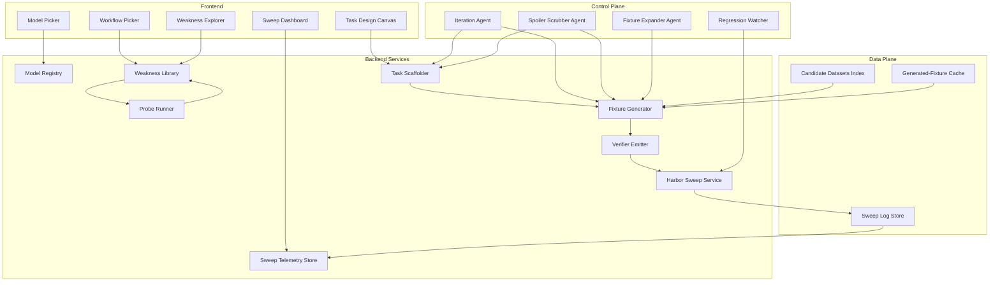

# learnings.md

> Handoff document for a fresh-context agent. The goal: take the lessons from this repo's Harbor-eval build against `google/gemini-3-flash-preview` and use them to design an online web app that automates the full pipeline (target model -> operational workflow -> validated Harbor task pack). This doc supersedes the older `learning_reports.md`. Treat it as exhaustive: you should not need to read the repo to design the platform, but every claim is anchored to a file path so you can verify.

---

## 1. Executive Summary

This repo is a case study in building a small, hard Harbor data-science eval (target: pass@3 < 30%, i.e. all three Gemini trials reward `< 0.6`) against a single frontier model: `google/gemini-3-flash-preview` via the `gemini-cli` Harbor agent. The work went through three eras:

1. **Trap-prompt era (`samples/ds-01b` through `samples/ds-17`).** Supply-chain medallion ETL tasks with explicit authority artifacts (precedence ledgers, hierarchy JSONs, dependency graphs), hybrid deterministic + LLM-judge verifiers, and trap gates. Many of these became too easy once spoilers were removed.
2. **De-spoil pass.** Systematic scrub of instruction prose, data dictionaries, authority JSONs, and prior notebooks. Documented in `report/despoil_results.md`. After de-spoiling, only `ds-11` and `ds-15` survived the pass@3 < 30% threshold; six tasks collapsed to pass@3 = 3/3 or 2/3, proving the prior difficulty was prompt-induced.
3. **Restaurant-style era (`samples/ds-18` through `samples/ds-25`).** Modeled on `restaurant-weekly-cost-control-audit/`. Real operational deliverables (workbooks), multimodal heterogeneous inputs (CSV/XLSX/PDF/JSON/JSONL/EML/notebook), strict structural verifiers using `pytest` + `openpyxl`, no LLM judges, no named traps, larger fixture surfaces, and plausible bait artifacts. Final restaurant-style suite is eight tasks (`ds-18` … `ds-25`), each implicitly exposing one of the eight distilled failure modes.

The single most important lesson: **modern models obey direct negation instructions ("do not use X") with high reliability, so difficulty cannot come from telling them what not to do. It must come from a realistic operational environment where the bad heuristic produces a complete-looking deliverable and the good heuristic requires reading the authority artifact correctly.** Probe-first, restaurant-style, deterministic-verifier task design is the production pattern. Trap-prompt task design is a recurring failure mode for the authors, not just the models.

The platform that follows from this is not a "prompt builder for hard puzzles." It is an experiment pipeline: workflow intake -> model registry -> probe runner -> weakness map -> task scaffolder -> fixture generator -> oracle/verifier emitter -> Harbor sweep -> trajectory auditor -> spoiler scrubber -> iteration loop -> pass@3 publication, with run-config lineage tracked at every step.

---

## 2. End-to-End Process We Actually Followed

This is the chronological process. Eight phases, observed in the repo.

### Phase 0 — Target Model Selection and Capability Bracketing

We picked one target model (`google/gemini-3-flash-preview`) and one runner (`gemini-cli`) up front. `report/eval_platform_memo.md` is explicit that mixing run configurations corrupts pass@k claims; the de-spoil sweep used `-a gemini-cli -m google/gemini-3-flash-preview` and ignored earlier runs that defaulted to `oracle`. Pass threshold: reward `>= 0.6`. Hard task definition: `pass@3 < 30%` operationalized as all three trials below `0.6`. Capability bracketing was implicit but real — Gemini handles clean structured CSV/JSON filtering with explicit policy easily, so any task whose hardness came from "follow the explicit instruction" was rejected at the probe stage.

### Phase 1 — Research and Weakness Mapping

Initial taxonomy in `EVAL_SET.md` and `report/REPORT.md` (FM2 false recency, FM3 fabricated authority, FM5 wrong-source/stale, FM6 phantom join, FM7 silent tie-breaking, FM9 cascade/null-imputation, FM10 provenance confabulation). Literature scan referenced agentic failure-mode papers, Terminal-Bench-3 rubric, DSAEval framing, and production ETL practice. Each candidate failure mode was attached to a realistic supply-chain workflow (price canonicalization, FX normalization, schema migration reconciliation, inventory planning, supplier dedup, UoM cascade, incoterms provenance, compliance dependency).

### Phase 2 — Lightweight Probing Before Building

This was the most leveraged phase. `probe_runs/deep_probe_gemini.py`, `probe_runs/replacement_probe_gemini.py`, and `probe_runs/revoked_evidence_probe.py` made compact JSON-only API calls to Gemini with multiple pressure variants per failure mode: plain framing, prior-work pressure, schema pressure, audit framing, speed framing. Each variant ran ~15 trials. No Harbor scaffold yet — raw API only. Scorers were candidate-specific. Outputs and raw model text were preserved.

### Phase 3 — Probe Decision Report

`probe_runs/deep_probe_decision_report.md` codified promote/reject decisions:

| Candidate | Failure rate | Decision |
| --- | --- | --- |
| `ds12_policy_collision` | 15/15 (100%) | Strong promote |
| `ds14_uom_cascade` | 15/15 (100%) | Strong promote |
| `ds16_document_authority` | 14/15 (93%) | Strong promote |
| `ds13_phantom_join` | 8/15 (53%) | Promote with hardening |
| `ds08_schema_mismatch` | 5/15 (33%) | Borderline; redesign as bridge lifecycle |
| `ds10_temporal_overlap` | 2/15 (13%) | Reject as framed; redesign with publication state |
| `ds15_landed_cost_stack` | 0/15 (0%) | Reject as framed; redesign as state machine |
| Direct revoked evidence | 0/15 (0%) | Reject; redesign as 2-hop dependency revocation |

Key learning: direct one-step framings that name the constraint were systematically too easy. The rejection list became a redesign queue, not a deletion queue.

### Phase 4 — First-Generation Harbor Tasks

Promoted candidates were scaffolded as Harbor packages under `samples/ds-08` through `samples/ds-17`, each with `task.toml`, `environment/Dockerfile`, `environment/data/build_inputs.py`, `instruction.md`, `solution/solve.sh`, `tests/test_outputs.py`, and most with `tests/llm_judge.py`. Verifiers were hybrid: deterministic dimensions + an LLM judge for basis prose + a trap gate that capped reward at `0.55` when a critical dimension failed.

### Phase 5 — Discovery That Several First-Gen Tasks Were Too Easy

Two failure patterns showed up during early calibration runs:

- Authority JSONs that contained answer-shaped fields. `ds-08`'s ledger had `v1_fallback_for_v2_rows: false`. `ds-13`'s contract had a `forbidden_transforms` list literally naming `suffix_stripping`, `zero_pad_normalization`, `delimiter_substitution`. Gemini followed those surface negations.
- Instructions, data dictionaries, and prior notebooks that explained the trap. The data dictionary for `ds-09` said "when a silver row has a missing or invalid numeric input … the gold formula cannot be evaluated." Prior notebooks were self-labelled with comments like "Substitutes a default factor when the ledger has no row" and "(newer valid_from)" and "(queue state ignored)" — turning bait into instructions.

### Phase 6 — De-spoil Pass

Tracked in `report/despoil_results.md`. Edits per task:

- `ds-08`: removed `v1_fallback_for_v2_rows`, replaced data-dictionary recipe with a neutral pointer, stripped `audit_notes` parenthetical that named failure modes.
- `ds-09`: removed the null-cascade recipe sentence from the data dictionary.
- `ds-10`: replaced four-step "publication contract" recipe with a one-line pointer; stripped trap labels (`(newer valid_from)`, `(queue state ignored)`) from the analyst notebook.
- `ds-11`: removed `ingestion_log.txt` "not a payload source" hint; dropped explicit allowed-bronze-filename enumeration.
- `ds-13`: removed `forbidden_transforms`; replaced "use contract as written" with "use the authority files under `/root/data`".
- `ds-14`: stripped notebook/SQL self-labels (`default 12`, `assumed 5`); removed kit-aggregation recipe; removed `Publish a line only when … Skip the line otherwise …` paragraph.
- `ds-15`: removed per-file "publishable state" callouts; removed parenthetical naming lifecycle stages.
- `ds-17`: removed "traversing the dependency graph" recipe; stripped notebook lines identifying which lab events were "not consulted"; removed `Do not list supplier_portal_export.csv (it is derivative)` and "only sanctioned authorities" wording.

Oracle/nop sanity stayed clean after every edit. Then Gemini was rerun on the corrected agent/model pin. Result table (`report/despoil_results.md`):

| Task | t1 | t2 | t3 | pass@3 | verdict |
| --- | --- | --- | --- | --- | --- |
| ds-08 | 0.55 | 0.55 | 0.967 | 1/3 | one passing trial; harden |
| ds-09 | 0.55 | 1.000 | 1.000 | 2/3 | too easy after de-spoil |
| ds-10 | 1.000 | 1.000 | 1.000 | 3/3 | too easy after de-spoil |
| ds-11 | 0.55 | 0.55 | 0.55 | 0/3 | below threshold |
| ds-13 | 0.917 | 0.933 | 0.917 | 3/3 | too easy after de-spoil |
| ds-14 | 1.000 | 1.000 | 1.000 | 3/3 | too easy after de-spoil |
| ds-15 | 0.34 | 0.34 | 0.34 | 0/3 | below threshold |
| ds-17 | 0.967 | 0.967 | 0.967 | 3/3 | too easy after de-spoil |

This is the candid lesson. The de-spoil sweep that landed Gemini at 3/3, 2/3, 1/3 on legacy tasks proved that most of the prior "difficulty" was prompt-induced. Only `ds-11` (mirror-source provenance with a trap gate) and `ds-15` (multi-stage landed-cost state machine) survived. Six tasks collapsed to easy.

### Phase 7 — Pivot to Restaurant-Reference Style

The `restaurant-weekly-cost-control-audit/` task — included in the repo as the gold-pattern reference — provided the model for a different design. It is a real operational deliverable (`/root/audit_report.xlsx`), multimodal (POS CSV, three invoice PDFs, recipes JSON, two inventory CSVs, labor XLSX, historical CSV), with a strict five-sheet workbook contract and a deterministic `pytest` + `openpyxl` verifier (`restaurant-weekly-cost-control-audit/tests/test_outputs.py`). No LLM judge. No named trap. Difficulty emerges from coordinating sources against the policy rather than from spotting an obvious trick.

We adopted the seven principles in §4 and rebuilt the task family from scratch as `ds-18` through `ds-25`. Each implicitly targets one of the eight distilled failure modes from §3.

### Phase 8 — Final 8-Task Restaurant-Style Suite

| Task | Workflow | Implicit failure mode | Verifier shape |
| --- | --- | --- | --- |
| `samples/ds-18-supplier-authority-review` | May supplier release review workbook | Authority ambiguity / fabricated authority | 5-sheet workbook, 11 pytest dimensions |
| `samples/ds-19-replenishment-recency` | Q2 inventory replenishment plan workbook | False recency | 5-sheet workbook, recomputes policy qty |
| `samples/ds-20-customs-duty-source` | Customs duty assessment workbook | Wrong source / stale source | 5-sheet workbook, source-label checks |
| `samples/ds-21-inventory-po-reconciliation` | Quarterly WMS-to-ERP reconciliation workbook | Phantom joins / normalization joins | 5-sheet workbook, crosswalk-vs-bridge gating |
| `samples/ds-22-sales-pricing-tiebreak` | Sales pricing canonicalization workbook | Silent tie-breaking | 5-sheet workbook, price desk queue |
| `samples/ds-23-yield-rollup-cascade` | Production yield rollup workbook | Null / invalid cascade | 5-sheet workbook, excluded-records routing |
| `samples/ds-24-customer-master-provenance` | Customer master provenance audit workbook | Provenance confabulation | 5-sheet workbook, authoritative-source map |
| `samples/ds-25-compliance-cert-release` | Q2 compliance certificate release workbook | Lifecycle / revocation propagation | 5-sheet workbook, dependency trace + cascade |

---

## 3. Failure-Mode Taxonomy (the 8 distilled categories)

Each category is defined operationally. "Real" means it survives de-spoiling and shows up structurally rather than because the prompt names the trap. "Structural" means the bad heuristic produces a complete-looking deliverable that fails a coverage or source-attribution check.

### 3.1 Authority Ambiguity / Fabricated Authority
The authority chain covers most conflicts but leaves a sanctioned subset uncovered. The model is tempted to invent precedence or invoke real-world domain knowledge (e.g. "CBP supersedes supplier") to publish a confident decision. Embodied in `samples/ds-18-supplier-authority-review` where uncovered conflicts must route to `MANUAL_REVIEW`, with conflicting sources surfaced in the `Manual Review Queue` and `Source Reconciliation` sheets. Why real: even with the precedence matrix supplied, the matrix has uncovered cells; the failure is publishing a release decision against an uncovered conflict. Structural: the verifier (`samples/ds-18-supplier-authority-review/tests/test_outputs.py`) checks the manual-review set, the conflicting source labels, the reconciliation rows, and the executive summary counts.

### 3.2 False Recency
"Latest" artifacts (POS, channel snapshots, prior notebook outputs) carry plausible signal but are not authority for the decision. The model is tempted to use a max-of-recent or last-modified rule. Embodied in `samples/ds-19-replenishment-recency`: the planning policy uses ERP forecast revisions, while a bait notebook computes `max(ERP, POS-derived, channel)` and a fixture category `RECENCY_TRAP` (`samples/ds-19-replenishment-recency/environment/data/build_inputs.py` line 62) injects SKUs where POS-derived qty diverges significantly from the policy-authorized ERP forecast. Why real: the recency heuristic is a real operational shortcut. Structural: verifier recomputes replenishment quantity from policy-authorized inputs and the stale-source audit sheet must list channels with `days_stale` past the threshold.

### 3.3 Wrong Source / Stale Source
Multiple plausible sources carry similar values; the authoritative source is determined by a policy file, not by apparent freshness or convenience. Examples include broker workpapers, supplier estimates, freight quotes, stale rate publications, recency-ranked unions. Embodied in `samples/ds-20-customs-duty-source`. Why real: production treasury and customs work routinely pick the wrong source when freshness or completeness is more visible than authority. Structural: source-label fields (`base_value_source`, `duty_rate_source`, `freight_source`) are scored independently from the numeric values.

### 3.4 Phantom Joins / Normalization Joins
Near-matching IDs invite suffix stripping, zero padding, delimiter substitution, or case folding even though no bridge policy authorizes the bridge. Embodied in `samples/ds-21-inventory-po-reconciliation`: WMS-to-ERP reconciliation with three trap families (`TRAP_SUFFIX_PAIRS`, `TRAP_ZEROPAD_PAIRS`, `TRAP_DELIM_PAIRS` in `environment/data/build_inputs.py`). Why real: prior reconciliation workbooks often carry forward analyst-improvised normalizations. Structural: the verifier requires trap rows to land in `Unmatched - Crosswalk Gap`, not `Matched Reconciliation`, and the `Match Basis` sheet must credit the policy bridge artifact rather than the prior workbook.

### 3.5 Silent Tie-Breaking
The hierarchy resolves most rows but exhausts itself on a subset; the operational deliverable wants canonical values, creating pressure to pick one. Embodied in `samples/ds-22-sales-pricing-tiebreak` with a `Price Desk Queue` sheet for unresolved ties. Why real: dual-active contract prices are common; the right answer is to queue for the price desk, not pick the first row. Structural: verifier re-derives the policy output from `customer_contract_prices.csv` and the `Pricing Audit Trail` sheet must show eligible-vs-chosen contract IDs.

### 3.6 Null / Invalid Cascade
Invalid sensor readings, missing standard deviations, negative demand, zero lead time. The model is tempted to impute (line/day average), clamp (negatives to zero), or default (12 if blank), then propagate plausible numbers downstream into kits and rollups. Embodied in `samples/ds-23-yield-rollup-cascade`: invalid sensor readings must exclude the run, not impute. Why real: prior planner methodology notebooks routinely encode imputation conventions, and leadership memos pressure for "complete reporting." Structural: verifier recomputes line/shift/plant rollups from sources and requires invalid runs to land in `Excluded Records`.

### 3.7 Provenance Confabulation
Multiple sources contain the same value, but the authoritative source for each field is defined by policy. The model is tempted to cite the most legible source, a mirror, ingestion metadata, or any "corroborating" source. Embodied in `samples/ds-24-customer-master-provenance`. Why real: getting the value right while citing the wrong source is the hardest hallucination to catch in production. Structural: verifier checks `authoritative_source_file` per field, separately from `supporting_sources` and `mirror_sources`, and `Phantom Records` sheet must list silver-only rows.

### 3.8 Lifecycle / Revocation Propagation
Direct revocation is easy ("certificate X was revoked"). Transitive revocation through a dependency graph is hard. State can be distributed across event logs, dependency graphs, portal exports, and prior workbooks. Embodied in `samples/ds-25-compliance-cert-release` with single, multi-dependency, pending, transitive, and portal-conflict revocation cases. Why real: `probe_runs/revoked_evidence_probe.py` got 0/15 failures on direct revocation — the model handles it. It became viable only as a 2-hop dependency task (`ds-17` originally; restaurant-style version is `ds-25`). Structural: verifier checks `Dependency Trace` (lab event chain), `Revocation Cascade` (which revoking event invalidates each cert), and `Conflict Log` (portal-says-active vs derived-revoked).

---

## 4. Restaurant-Reference Design Principles (the 7)

Lifted from `restaurant-weekly-cost-control-audit/instruction.md` and `restaurant-weekly-cost-control-audit/tests/test_outputs.py` and confirmed across `samples/ds-18` … `samples/ds-25`.

1. **Realistic operational deliverable.** Not "answer a JSON puzzle." Phrased as "I need the weekly cost control workbook" or "I need the May supplier release review workbook." The user has business reasons to want the artifact; the model is doing real work, not solving a riddle.
2. **Strict output contract.** Exact filename (`/root/audit_report.xlsx`, `/root/supplier_authority_review.xlsx`, `/root/replenishment_plan.xlsx`, …), exact sheet names, exact column headers, exact label strings (`metric`, `value`, `rank`, `concern`, `exposure_count`), numeric values stored as numbers not text. The verifier reads structurally.
3. **Multimodal heterogeneous inputs.** CSV + XLSX + PDF + JSON + JSONL + EML + notebook + plain-text memo + extracted-text fallback. PDFs are read with `pdfplumber`; XLSX with `openpyxl`; JSONL line-by-line. The agent has to coordinate formats, not just CSV columns.
4. **Authority encoded in artifacts.** Policy lives in a PDF (`procurement_policy.pdf`, `planning_policy.pdf`, `yield_calculation_policy.pdf`, `compliance_policy.pdf`, `bridge_policy.pdf`, `sales_pricing_policy.pdf`, `provenance_policy.pdf`). The agent must read it. Authority is never explained in the instruction prose.
5. **Larger fixture surface.** Dozens of clean rows mixed with several trap families. `ds-18` has 15 clean releases + 5 trade-block holds + 4 ERP holds + 3 critical quality holds + 5 minor-attestation releases + 5 major-attestation holds + 12 manual-review cases + 3 inactive (43+ active suppliers). Trap rows hide among normal rows so the failure is not a single-row puzzle.
6. **Deterministic structural verifier.** No LLM judge. `pytest` checks structural requirements first (file exists, sheets exist, headers match), then row-set coverage, then per-trap-family dimensions, then source attribution, then summary counts. Binary reward — `reward.txt = 1` only if every pytest passes; otherwise `0`. See `samples/ds-18-supplier-authority-review/tests/test.sh`.
7. **Failure emerges from environment.** The bad heuristic produces a complete-looking workbook. The good heuristic requires reading the policy PDF and routing trap rows correctly. The instruction never says "do not normalize keys" or "do not impute nulls" or "do not use the prior notebook."

---

## 5. Anti-Patterns We Found

Each item is an actual mistake from this repo, with the file path.

- **Instructions that name the trap.** `samples/ds-08` originally had an `audit_notes` parenthetical listing `revoked bridge, missing bridge row, v1 fallback used inappropriately`. Removed in de-spoil. Lesson: never name failure modes in instructions.
- **Data dictionaries that double as verifier pseudocode.** `samples/ds-09` data dictionary literally explained the null-cascade rule. `samples/ds-10` had a four-step "publication contract" recipe. `samples/ds-14` had a "publish only when / skip otherwise" paragraph. All removed in de-spoil. Lesson: data dictionaries should describe what the columns *mean*, not what the verifier *checks*.
- **Prior notebooks labelled wrong instead of plausible bait.** `samples/ds-10`'s analyst notebook had inline comments `(newer valid_from)`, `(queue state ignored)`. `samples/ds-14`'s notebook had `Substitutes a default factor when the ledger has no row`, `default 12`, `assumed 5`. `samples/ds-17`'s notebook explicitly identified which lab events were "not consulted." These labels turned bait into a tutorial. Lesson: bait notebooks should read as a draft proposal a previous analyst would actually have written, not a self-incriminating confession.
- **Authority JSONs containing answer fields.** `samples/ds-08`'s `LEDGER` had `v1_fallback_for_v2_rows: false`. `samples/ds-13`'s `CONTRACT` had `forbidden_transforms: [suffix_stripping, zero_pad_normalization, delimiter_substitution]`. Both flags were the answer. Lesson: authority artifacts encode business policy, not lists of traps.
- **Fixtures too small.** Early tasks had a handful of rows; the trap row was the only ambiguous one. Restaurant-style fixtures have dozens of clean rows per trap family so the failure must be diagnosed against operational background noise.
- **Single-state tasks.** Direct revoked-evidence (`probe_runs/revoked_evidence_probe.py`, 0/15 failures), direct temporal overlap (2/15), and direct landed-cost (0/15) probes all failed because the failure was one step. The redesign moved to multi-state: bridge lifecycle (`ds-08`), 2-hop dependency revocation (`ds-17`/`ds-25`), state-machine landed cost (`ds-15`), publication-state overlap (`ds-10`).
- **LLM-judge dependent verifiers.** Hybrid deterministic + LLM-judge worked for free-form basis prose but introduced contamination, cost, debugging difficulty, and gameability. The restaurant-style tasks dropped LLM judges entirely. Lesson: deterministic workbook checks can cover most dimensions; reserve LLM judges for genuinely semantic prose only with strong human review.
- **Measuring value correctness without source correctness.** `samples/ds-16-incoterms-evidence-attribution` was promoted because Gemini got values right but cited unauthorized corroborating sources (14/15 probe failures). Lesson: source attribution must be a scored dimension separate from value correctness.
- **Answer files in agent-visible data.** `samples/ds-12` initially had `.oracle_expected.json` inside `/root/data`, making the task trivially passable. Documented in `report/probe_backed_task_results.md`. Lesson: expected answers never live anywhere the agent can read.
- **Mixing run configurations.** `report/eval_platform_memo.md` is explicit that a Gemini sweep without `-a gemini-cli` defaults to `oracle`-shaped behavior; those runs must be excluded from final claims.

---

## 6. Harbor-Task Scaffold Blueprint

Canonical restaurant-style file layout (`samples/ds-18-supplier-authority-review/`):

```
ds-18-supplier-authority-review/
  instruction.md                          # operational deliverable, output contract
  task.toml                               # version, difficulty, timeouts, env
  environment/
    Dockerfile                            # python:3.12 + fpdf2 + openpyxl + pandas + pdfplumber
    data/
      build_inputs.py                     # 700-900 LOC; emits /root/data fixture
  solution/
    solve.sh                              # python heredoc; the oracle
  tests/
    test.sh                               # installs pytest + pytest-json-ctrf, runs verifier, writes reward.txt
    test_outputs.py                       # deterministic pytest verifier
```

Per-file role and gotchas observed during the build:

- **`task.toml`**: version, `[metadata].difficulty = "hard"`, `[metadata].failure_mode` tag (used internally for tracking), `[verifier].timeout_sec = 900`, `[agent].timeout_sec = 1800`, `[environment].cpus = 1`, `[environment].memory_mb = 4096`, `[environment].storage_mb = 10240`. `[environment.env].GEMINI_CLI_TRUST_WORKSPACE = "true"` is required for the gemini-cli agent.
- **`environment/Dockerfile`**: `FROM python:3.12` (not `ubuntu` + `apt`). The Python base image avoids apt brittleness during build, has pip pre-installed, and reaches steady-state in under 60s. Installs pinned versions: `fpdf2==2.8.2`, `openpyxl==3.1.5`, `pandas==2.2.3`, `pdfplumber==0.11.4`. Builds fixtures with `python3 /tmp/task-data/build_inputs.py` then deletes the source.
- **`environment/data/build_inputs.py`**: 700-900 LOC per task. Defines fixture categories (clean families and trap families), generates IDs deterministically with a seeded `random.Random`, emits CSVs/XLSX/PDF/JSON/JSONL/notebook. Gotchas: `fpdf2` `multi_cell` requires explicit width (use `w=0` for full-page width); JSONL must be one record per line with no trailing newline issues; XLSX with multiple sheets needs `wb.remove(wb.active)` before adding named sheets; PDFs intended for `pdfplumber` reads should avoid embedded images and use `set_font` + `cell` / `multi_cell` patterns.
- **`instruction.md`**: business framing ("I need the …"), explicit output path, input file inventory, exact sheet names, exact header rows (verbatim), exact label strings, numeric-vs-text expectation, decision date or close window. Does not name the failure mode, does not list "do nots", does not describe the verifier.
- **`solution/solve.sh`**: `#!/bin/bash` + `set -e` + python heredoc. Reads from `/root/data`, writes to the exact output path. Must produce reward `1.0` against the verifier. Re-implements the policy from the input artifacts; does not consult any hidden expected-answer file.
- **`tests/test.sh`**: installs pytest + `pytest-json-ctrf` + openpyxl with `--break-system-packages`, runs pytest with `--ctrf /logs/verifier/ctrf.json`, writes `1` or `0` to `/logs/verifier/reward.txt` based on exit code. Always `exit 0` after writing reward so Harbor captures the artifact even on failure.
- **`tests/test_outputs.py`**: pytest module with one `TestX` class. Module-scoped fixture loads the workbook. Tests in order: required sheets exist, required headers match, every active entity routed exactly once, per-category correctness (`test_clean_release_decisions`, `test_clean_hold_decisions`, `test_uncovered_conflicts_are_manual_review`), per-trap-family routing (`test_manual_review_queue_complete`, `test_manual_review_queue_lists_correct_conflicting_sources`), source attribution (`test_source_reconciliation_has_rows_for_manual_review`), executive summary counts (`test_executive_summary_counts`), numeric-type assertions (`test_risk_score_is_numeric`).
- **Oracle/nop sanity**: oracle must produce reward `1` before any Gemini sweep. Nop (empty solve) must produce reward `0`. Both confirmed in `logs/ds-18-oracle`, `logs/ds-18-nop`, `logs/ds-18-oracle2`, `logs/ds-18-nop2` (the `2` suffix indicates a second sanity check after a fixture or verifier edit).

---

## 7. Iteration Loop We Used Per Task

The build -> oracle -> nop -> Gemini-trial-x3 -> iterate loop:

1. Scaffold the task. Generate `instruction.md`, `task.toml`, `Dockerfile`, `build_inputs.py`, `solve.sh`, `test_outputs.py`.
2. Run `oracle` (`-a oracle`). Must produce reward `1.0`. If not, fix the verifier or oracle until it does.
3. Run `nop` (`-a nop`). Must produce reward `0.0`. If not, the verifier is over-permissive — tighten.
4. Run three Gemini trials (`-a gemini-cli -m google/gemini-3-flash-preview`). Capture `reward.txt`, `ctrf.json`, `trial.log`, `agent/trajectory.json`, `agent/gemini-cli.trajectory.jsonl`.
5. Compute pass@3. If `>= 1/3`, diagnose the failing dimensions, iterate on bait realism and fixture surface, and re-run.
6. Stop conditions: pass@3 = 0/3 with oracle = 1, nop = 0, no spoiler-lint findings, trajectory audit confirms genuine model failure (not formatting accident or environment bug).

Concrete iteration examples from `logs/`:

- **`ds-19-replenishment-recency`**: required 2 rounds. First round had bait notebook (`prior_quarter_replenishment_plan.ipynb`) self-labelled as wrong in the build_inputs categorization (`RECENCY_TRAP`, see `samples/ds-19-replenishment-recency/environment/data/build_inputs.py` line 62-68). Second-round edit rewrote the notebook narrative to read as a draft proposal that mechanically applied a max-of-recent rule, without self-incriminating commentary. Final result: `logs/ds-19-t1` = 0, `logs/ds-19-t2` = 0, `logs/ds-19-t3` = 0. pass@3 = 0/3.
- **`ds-21-inventory-po-reconciliation`**: required 2 rounds. v1 (`logs/ds-21-t1/t2/t3`) scored 0/0/1 = 1/3. The first round had an explicit "no normalization" sentence in the bridge policy PDF that the model could trivially obey. v2 dropped that sentence and re-anchored the policy on positive bridge rules (BR-01/BR-02/BR-03 in `bridge_policy.pdf`), letting the verifier catch trap-route violations structurally. v2 (`logs/ds-21-v2-t1/t2/t3`) scored 0/0/0 = 0/3. The bait workbook (`prior_reconciliation_workbook.xlsx`) was rewritten so analyst notes say "carried forward from Q4 2025" rather than labeling rows as "approximate" or "suffix-strip-derived".
- **`ds-23-yield-rollup-cascade`**: required 2 rounds. v1 (`logs/ds-23-t1/t2/t3`) scored 1/1/0 = 2/3. The bait `prior_shift_workbook.xlsx` had a `Method Notes` sheet that read as a tutorial — five numbered steps for imputation. Final v2 (`logs/ds-23-final-t1/t2/t3`) scored 0/0/0 = 0/3 after the method notes were rewritten as draft analyst rationale without the numbered recipe, and trap categories were broadened so the cascade has more places to surface.
- **`ds-20-customs-duty-source`**: iterated through `t1/t2`, `c-t1/c-t2`, `d-t1/d-t2/d-t3`, `e-t1/e-t2/e-t3` (e-t3 in progress at the time of writing). The iteration journey was driven by Gemini repeatedly finding new attack paths: original framing was solvable by reading the broker workpaper carefully; iteration `c` added more source plausibility; `d` added stale rate publication; `e` is the latest revision. Final status: unverified at time of writing because `logs/ds-20-e-t3` is still running.

The two-round-because-of-self-labelled-bait pattern (ds-19 and ds-23) is the single most common iteration cause. The spoiler scrubber agent must lint bait artifacts as harshly as it lints instruction prose.

---

## 8. Concrete Sweep Telemetry

### Legacy de-spoil set (`samples/ds-08` through `samples/ds-17`)

Pulled verbatim from `report/despoil_results.md`. `ds-01b`, `ds-04`, `ds-07`, `ds-12`, `ds-16` were reviewed but not part of the de-spoil edit set; their final de-spoil pass@3 is not present in the inspected artifacts.

| Task | Failure mode | Fixture size (approx) | Iteration count | Pass@3 (final de-spoil) |
| --- | --- | --- | --- | --- |
| `ds-08-schema-migration-contract-drift` | Schema drift / FM3 | ~20 shipments + bridge ledger | de-spoil + harden | 1/3 |
| `ds-09-null-propagating-cascade` | FM9 | ~25 SKUs + bundles | de-spoil | 2/3 (too easy after de-spoil) |
| `ds-10-calendar-state-price-overlap` | FM7 | ~15 customer/SKU + state events | long-horizon + de-spoil | 3/3 (too easy after de-spoil) |
| `ds-11-multimodal-provenance-audit` | FM10 | 10 silver rows, 6 bronze + metadata | de-spoil | 0/3 |
| `ds-13-po-shipment-revision-spec-mismatch` | FM6 | ~30 ASN + crosswalk + lifecycle | long-horizon + de-spoil | 3/3 (too easy after de-spoil) |
| `ds-14-uom-normalization-cascade` | FM9 | ~25 lines + kits + ledger | de-spoil | 3/3 (too easy after de-spoil) |
| `ds-15-landed-cost-state-machine` | FM5 + state | ~12 POs + multi-event | long-horizon + de-spoil | 0/3 |
| `ds-17-compliance-dependency-revocation` | Lifecycle / FM9 | ~20 certs + dependency graph | long-horizon + de-spoil | 3/3 (too easy after de-spoil) |

### New restaurant-style set (`samples/ds-18` through `samples/ds-25`)

Pulled directly from `logs/<task>-t{1,2,3}/.../verifier/reward.txt`. Restaurant-style tasks use binary reward (0 or 1) rather than fractional, so pass@3 is computed as a sum of trial-binaries.

| Task | Failure mode | Fixture size | Iterations | Pass@3 |
| --- | --- | --- | --- | --- |
| `ds-18-supplier-authority-review` | Authority ambiguity | ~46 suppliers (15+5+4+3+5+5+12+3) | 1 | 0/3 (t1=0, t2=0, t3=0) |
| `ds-19-replenishment-recency` | False recency | ~30 SKUs incl. 12 RECENCY_TRAP + 5 STALE | 2 (bait notebook self-label) | 0/3 (t1=0, t2=0, t3=0) |
| `ds-20-customs-duty-source` | Wrong source / stale | multi-file source set | 4+ (c, d, e) | Unverified — `logs/ds-20-e-t3` still running at time of writing |
| `ds-21-inventory-po-reconciliation` | Phantom join | ~30 WMS items + trap families | 2 (v1=1/3, v2=0/3) | v2: 0/3 (t1=0, t3=0; t2 incomplete/timed-out per `logs/ds-21-v2-t2/.../exception.txt`, but ds-21-v2-t2b = 0) |
| `ds-22-sales-pricing-tiebreak` | Silent tie-breaking | distributor/customer/sku combos | oracle revised v1→v2→final | 0/3 (t1=0, t2=0, t3=0) |
| `ds-23-yield-rollup-cascade` | Null/invalid cascade | ~370 runs (12 lines × 31 days) | 2 (v1=2/3, final=0/3) | final: 0/3 |
| `ds-24-customer-master-provenance` | Provenance confabulation | multi-source customer master | 1 | 0/3 (t1=0, t2=0, t3=0) |
| `ds-25-compliance-cert-release` | Lifecycle / revocation propagation | certs + 5-case revocation cascade | 1 | 0/3 (t1=0, t2=0, t3=0) |

Final restaurant-style verdict: 6 tasks confirmed at pass@3 = 0/3 (ds-18, ds-19, ds-21, ds-23, ds-24, ds-25). ds-22 confirmed at 0/3 in `logs/ds-22-t1/t2/t3`. ds-20 status is unverified — the final iteration `e-t3` was still running when this document was written. Treat ds-20 as in-progress in any platform claim.

---

## 9. Automation Map (the most important section for the platform agent)

Per phase: user inputs, intermediate artifacts, automation primitives, quality gates, user intervention points.

### Phase 0: Model and threshold registration
- **User inputs**: target model slug, agent/runner adapter (e.g. `gemini-cli`), invocation flags, temperature, max trial budget per phase, per-trial cost ceiling, pass threshold (reward >= 0.6 default), target difficulty band (pass@3 < 30% default).
- **Artifacts produced**: a `RunConfig` record pinned for the whole project lifecycle.
- **Primitives**: model-registry service, runner-adapter library (oracle, nop, gemini-cli, claude-cli, codex-cli, openai-responses).
- **Quality gates**: reject aggregation across incompatible run configs.
- **User intervention**: confirm model+runner before any spend.

### Phase 1: Workflow intake and weakness mapping
- **User inputs**: domain (procurement, treasury, manufacturing, logistics, customer master, …), operational deliverable shape (workbook, JSON, reconciliation pack, audit report, release gate), candidate data sources (Kaggle dataset URLs, user-uploaded SOPs, public dbt repos, regulatory PDFs), candidate failure-mode preferences.
- **Artifacts produced**: a typed `TaskIdea` (domain, workflow, target user, artifacts, output contract, weakness hypotheses), and a `WeaknessReport` (5-10 candidate failure-mode cards).
- **Primitives**: research ingestion agent (paper/benchmark/Kaggle/dbt scan), failure-mode mapper that pattern-matches against the 8-category taxonomy in §3, weakness-card emitter.
- **Quality gates**: each candidate card must have (a) workflow fit, (b) attractive bad heuristic, (c) authority invariant, (d) plausible bait artifact, (e) candidate verifier strategy.
- **User intervention**: review and approve weakness map before probe spend.

### Phase 2: Probe generation and execution
- **User inputs**: probe trial budget per candidate (default 15), pressure variants to include.
- **Artifacts produced**: a `ProbePack` JSON (one prompt per variant), `ProbeResults` JSONL (raw model output per trial), `ProbeScores` (failure rate per candidate).
- **Primitives**: probe generator (synthesizes compact JSON-only prompts with the 5 pressure variants from §2-Phase-2), probe runner (parallel API calls, structured-output parsing, candidate-specific scorers), failure classifier.
- **Quality gates**: probe acceptance threshold — strong promote `>= 80%` fail rate, promote-with-hardening `40-79%`, redesign `15-39%`, reject as framed `< 15%`. Borderline candidates move to redesign queue, not deletion.
- **User intervention**: review probe outputs and approve promote/reject decisions.

### Phase 3: Probe decision report
- **Artifacts produced**: a `DecisionReport` matching the format of `probe_runs/deep_probe_decision_report.md`.
- **Primitives**: decision-report renderer.
- **Quality gates**: every candidate must have a decision and a recommended next action.
- **User intervention**: human approval of the queue before scaffold spend.

### Phase 4: Task scaffolding
- **User inputs**: chosen output shape (default: workbook), target output path, target sheet roster.
- **Artifacts produced**: a scaffolded Harbor repo matching §6's blueprint, with `instruction.md`, `task.toml`, `environment/Dockerfile`, `environment/data/build_inputs.py` skeleton, `solution/solve.sh` skeleton, `tests/test.sh`, `tests/test_outputs.py` skeleton.
- **Primitives**: scaffold generator, output-contract synthesizer (proposes sheet names and headers from the weakness card).
- **Quality gates**: scaffold lint — `task.toml` valid, Dockerfile builds, output path declared in instruction matches the verifier-expected path.
- **User intervention**: review instruction clarity and output contract.

### Phase 5: Fixture generation
- **User inputs**: target fixture surface (suggested defaults: 30-50 active entities, ≥3 trap families with 2-12 rows each, 1-3 plausible bait artifacts), policy artifact format (PDF default).
- **Artifacts produced**: a `FixtureSpec` JSON listing every category, every row count, every trap parameter; a generated `build_inputs.py` that emits multimodal artifacts; a regenerable seed.
- **Primitives**: fixture-spec emitter, multimodal artifact generator (CSV, XLSX with multiple sheets, PDF via `fpdf2`, JSON, JSONL, EML, ipynb), bait artifact generator (prior workbook, prior notebook, leadership memo, broker workpaper).
- **Quality gates**: fixture lint — no expected-answer file in `/root/data`, no trap labels in filenames or notebook cells, fixture-size threshold met.
- **User intervention**: approve fixture spec.

### Phase 6: Oracle and verifier emission
- **Artifacts produced**: `solution/solve.sh` (full oracle that reads `/root/data` and produces the deliverable) and `tests/test_outputs.py` (deterministic pytest verifier).
- **Primitives**: oracle synthesizer (compiles policy rules into a Python implementation), deterministic verifier emitter (generates structural + row-coverage + source-attribution + summary-count tests).
- **Quality gates**: oracle reward = 1.0, nop reward = 0.0, both via Harbor.
- **User intervention**: review oracle correctness (the oracle is the auditable ground truth and may need adjustment if the policy is ambiguous).

### Phase 7: Sweep orchestration and trajectory audit
- **User inputs**: trial count per task (default 3 for pass@3), retry policy on infra error, parallelism.
- **Artifacts produced**: a `SweepLog` listing every trial's reward, trajectory, verifier ctrf, cost.
- **Primitives**: Harbor sweep service (queues oracle, nop, target-model trials with pinned config; parses `reward.txt`, `reward.json`, `details.json`, `ctrf.json`; computes pass@k), trajectory auditor (sends failing trajectory + instruction to an independent auditor agent — must NOT be the same model under test — that classifies failures as `ignored_authority_artifact`, `used_prior_work_heuristic`, `format_violation`, `misread_input_file`, `task_design_bug`, `environment_failure`).
- **Quality gates**: pass@3 acceptance — pass@3 = 0/3 required for "hard" verdict; pass@3 ≥ 1/3 triggers iteration; oracle/nop tripwires re-run on every fixture or verifier change.
- **User intervention**: review trajectory audit before accepting "hard" verdict.

### Phase 8: Iteration agent and spoiler scrubber
- **Artifacts produced**: a `SpoilerReport` (findings from the linter), an `IterationPlan` (recommended edits to bait, fixture, policy artifact, or output contract).
- **Primitives**: spoiler scrubber agent (lints instruction prose, data dictionaries, policy PDFs, authority JSONs, notebook cells, and SQL files for: trap names, answer-shaped fields, recipe sentences, self-labelled bait, explicit `Do not …` instructions, exact expected-answer files in agent-visible paths, dictionary entries that double as verifier pseudocode), fixture-expander agent (proposes larger surfaces when the model passes from random luck), regression watcher (re-runs sweeps after edits and flags any task that flipped easy).
- **Quality gates**: spoiler lint must be clean before sweep; max iteration count per task (default 5) — beyond that, retire candidate or escalate to human author.
- **User intervention**: accept final pass@3 and final task pack.

### Stop conditions per task

A task graduates to "published hard" only when all of: oracle=1, nop=0, spoiler lint clean, pass@3=0/3, trajectory audit confirms ≥2/3 failures are `ignored_authority_artifact` or `used_prior_work_heuristic` (genuine model weakness, not format/env/design bug), and the run config is pinned to the same `RunConfig` as the project.

### Open question: judge model selection
Trajectory auditor must NOT be the target model — that's contamination. Default to a different vendor (e.g. audit Gemini sweeps with Claude or GPT-5). The platform should expose `auditor_model` as a separate config and warn if it overlaps with the target.

---

## 10. Reference Architecture for the Web App



### Frontend

- **Model picker**: select target model + runner, pin invocation flags. Stores a `RunConfig` for the project.
- **Workflow picker**: pick a domain template (procurement supplier release, inventory replenishment, customs duty assessment, WMS-to-ERP reconciliation, sales pricing canonicalization, production yield rollup, customer master audit, compliance certificate release) or bring-your-own intake.
- **Weakness explorer**: browse the 8-category taxonomy and the platform's accumulated library of candidate failure modes, with probe history per candidate.
- **Task design canvas**: side-by-side editor for `instruction.md`, fixture spec, output contract, verifier dimensions, with live spoiler-lint warnings.
- **Sweep dashboard**: pass@3 per task, iteration count, trajectory cluster view, regression timeline.

### Backend services

- **Model registry**: model slugs, runner adapters, flags, temperatures, timeouts, cost models. Rejects mixed-config aggregation.
- **Probe runner**: compact API calls with the 5 pressure variants. Returns a `ProbeScores` artifact.
- **Weakness library**: persistent store of failure-mode candidates, probe history, promote/reject decisions, redesign queue.
- **Task scaffolder**: emits the §6 blueprint from a weakness card.
- **Fixture generator**: emits `build_inputs.py` + multimodal artifacts from a `FixtureSpec`.
- **Verifier emitter**: generates deterministic pytest tests from an output contract and trap-family list.
- **Harbor sweep service**: queues oracle/nop/target-model trials, parses rewards, computes pass@k.
- **Sweep telemetry store**: per-trial rewards, trajectories, ctrf, costs, phase labels (probe / oracle-sanity / calibration / de-spoil / regression / final).

### Data plane

- **Candidate datasets index**: Kaggle/HuggingFace/public dbt project metadata with license info. Never copies data without provenance; uses schema patterns to inspire synthetic fixtures.
- **Generated-fixture cache**: keyed by `FixtureSpec` hash so identical specs reuse bytes.
- **Sweep log store**: full trial artifacts (logs, trajectories, verifier outputs) keyed by run config + task version.

### Control plane

- **Iteration agent**: given a pass@3 ≥ 1/3 result + trajectory audit, proposes the next edit (bait realism, fixture surface, policy artifact rewrite, output-contract tightening).
- **Spoiler scrubber agent**: lints every text artifact for trap names, answer fields, recipe sentences, self-labelled bait, expected-answer files in agent-visible paths.
- **Fixture expander agent**: when the model passes from luck, proposes additional trap families or larger fixtures.
- **Regression watcher**: re-runs prior sweeps after any edit and flags tasks that flipped easy.

---

## 11. Open Questions the Platform Agent Must Resolve

These are the unresolved policy questions the platform must answer explicitly. Each one bit us in the repo and is unresolved at hand-off.

1. **Judge model contamination.** Trajectory auditors and weakness-promotion judges must NOT be the same model as the target. What is the canonical separation matrix? Default: audit Gemini with Claude or GPT-5; audit Claude with Gemini or GPT-5; audit GPT-5 with Claude or Gemini. The platform should refuse to set `auditor_model == target_model` without an explicit override.
2. **Dataset licensing for Kaggle / public reuse.** This repo never directly copied Kaggle data into Harbor packages; fixtures are synthesized to match realistic schemas. The platform needs an explicit licensing policy: which datasets allow derivative-fixture inspiration, which allow direct reuse, and which are forbidden (especially when the public dataset includes a benchmark answer set the model may have seen during training).
3. **Multi-model generalization.** Every claim in this repo is against `google/gemini-3-flash-preview`. Whether the same tasks remain hard against Claude 4.6 Sonnet, GPT-5.3 Codex, or future Gemini revisions is untested. Platform requirement: when a task graduates to "published hard," automatically run a cross-model sweep (with cost approval) to label tasks as "hard for X," "hard for X and Y," or "frontier-general hard."
4. **Cost / SLA model per probe and per sweep.** This repo does not track cost or latency systematically. The platform must measure tokens, wall time, retries, and API errors per trial and surface per-task and per-phase budgets. The user must approve cost ceilings before any spend phase.
5. **IP / data exfiltration for user-uploaded corpora.** Restaurant-style tasks include realistic-looking artifacts. If a customer uploads internal SOPs or proprietary policy PDFs to inspire fixtures, the platform must (a) not include the originals in generated tasks, (b) not send originals to third-party models without explicit consent, and (c) provide a redaction pass before any fixture synthesis.
6. **Probe-promotion threshold policy.** The 8/15 ds13_phantom_join case shows that strict probe thresholds would have rejected a candidate that later became a published hard task after long-horizon redesign. The platform should preserve borderline candidates in a redesign queue rather than deleting them.
7. **Verifier reward shape.** Restaurant-style verifiers are binary (1 if all pytest passes, 0 otherwise). Legacy tasks used fractional reward (0..1) with trap-gate caps at 0.55. The platform needs an explicit policy: binary by default (simpler, harder to game) with fractional as an opt-in for partial-credit tasks.
8. **Run-config lineage at the data-store level.** Every result must carry its `RunConfig` hash. The platform must refuse to aggregate pass@k across hashes and must show partial-sweep status (e.g. ds-20 t3 still running) without silently rounding to a final number.
9. **Bait artifact realism floor.** The two-round-because-of-self-labelled-bait failures (ds-19, ds-23) suggest the platform needs an automated bait-realism check: bait narratives should sound like an analyst draft, not a tutorial. This is hard to fully automate; needs a dedicated linter + human spot-check policy.
10. **When to retire vs iterate.** The de-spoil sweep collapsed 6 legacy tasks. At what iteration count or cost does a candidate get retired rather than redesigned further? Suggested default: 5 iterations or 30 trials, whichever comes first, then escalate to human author.

---

## Appendix: One-line claim-to-evidence map

For platform agents auditing this document:

- pass@3 numbers per restaurant-style task: `logs/ds-18-t{1,2,3}/.../verifier/reward.txt` through `logs/ds-25-t{1,2,3}/.../verifier/reward.txt`. ds-23's final v2 sweep is `logs/ds-23-final-t{1,2,3}`. ds-21's v2 sweep is `logs/ds-21-v2-t{1,2,3}`. ds-20 is iterating across `logs/ds-20-{,c-,d-,e-}t{1,2,3}` and unverified at write time.
- De-spoil pass@3 numbers: `report/despoil_results.md` (canonical), backed by `logs/<task>-despoil-t{1,2,3}/`.
- Probe failure rates and promote/reject decisions: `probe_runs/deep_probe_decision_report.md`, raw at `probe_runs/deep_probe_20260520T153517Z.json` and `probe_runs/replacement_probe_20260520T154852Z.json`.
- Gold pattern: `restaurant-weekly-cost-control-audit/instruction.md` and `restaurant-weekly-cost-control-audit/tests/test_outputs.py`.
- Canonical restaurant-style scaffold: `samples/ds-18-supplier-authority-review/` (instruction, task.toml, environment/Dockerfile, environment/data/build_inputs.py, solution/solve.sh, tests/test.sh, tests/test_outputs.py).
- Original taxonomy and design intent: `EVAL_SET.md`, `report/REPORT.md`.
- Prior planning context: `report/eval_platform_memo.md`, the predecessor `learning_reports.md` (this doc supersedes it).
- Run-config lineage rationale: `report/eval_platform_memo.md` (the "misconfigured Gemini run" caveat).
